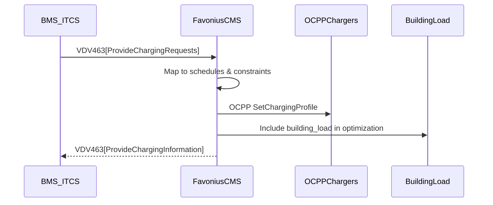

# Product Requirements Document
## Favonius Energy — EV Fleet Depot Optimization Platform
### Version 2.7 (MVP) | January 2025

---

## Document Purpose

This PRD serves as the **single source of truth** for building the Favonius MVP. It is structured for:
1. **Human engineers** — Clear problem statements, acceptance criteria, and design decisions
2. **AI coding agents (Cursor, Claude Code)** — Precise specifications, code patterns, and validation rules

**How to use this document with Cursor IDE:**
- Reference sections using `@PRD_v2.md#section-name`
- AI agents should check acceptance criteria before marking tasks complete
- Data models are authoritative — do not deviate without updating this document

---

## Table of Contents

1. [Executive Summary](#1-executive-summary)
2. [Problem Statement](#2-problem-statement)
3. [Solution Overview](#3-solution-overview)
4. [User Stories & Use Cases](#4-user-stories--use-cases)
5. [System Architecture](#5-system-architecture)
6. [Data Models](#6-data-models)
7. [API Specifications](#7-api-specifications)
8. [Optimization Engine Specifications](#8-optimization-engine-specifications)
9. [Integration Requirements](#9-integration-requirements)
10. [Non-Functional Requirements](#10-non-functional-requirements)
11. [Acceptance Criteria](#11-acceptance-criteria)
12. [Glossary](#12-glossary)

---

## 1. Executive Summary

### 1.1 Product Vision

Favonius Energy delivers an integrated depot energy management platform that coordinates EV charging schedules, stationary batteries, and building loads to **reduce electricity costs by 30-50%** for commercial fleet operators.

### 1.2 MVP Scope

| In Scope (MVP) | Out of Scope (Post-MVP) |
|----------------|------------------------|
| Demand charge minimization | V2G (vehicle-to-grid) |
| EV charging scheduling | Solar generation prediction |
| Stationary battery dispatch | Advanced price forecasting (RL) |
| Market price integration (TOU, CAISO) | Customer dashboard |
| OCPP 1.6 charger control (handles OCPP 2+ messages, CCS only) | Mobile app |
| Energy consumption surrogate model | Multi-company deployments |
| Re-optimization triggers | Grid services participation |
| Single-depot operation | Full carbon accounting |
| Inter-depot vehicle handoff messaging | Multi-connector support (CHAdeMO, Type2, NACS) |
| Building load integration | OCPI roaming integration |
| **VDV 463 transit operations integration** | OpenADR demand response |
| **VDV 261 bus preconditioning (via VDV 463)** | — |

### 1.3 Success Metrics

| Metric | Target | Measurement |
|--------|--------|-------------|
| Demand charge reduction | ≥ 30% | (Baseline - Optimized) / Baseline |
| Optimization solve time | < 60 seconds | Gurobi wall-clock time (excluding state assembly and dispatch) for 20 vehicles |
| Vehicle departure SoC | 100% of departures ≥ 99% SoC | Telemetry validation |
| System uptime | ≥ 99.5% | Monitoring (excluding maintenance) |
| Energy consumption prediction | R² ≥ 0.85 | 7-day rolling validation |

---

## 2. Problem Statement

### 2.1 The Challenge

Commercial EV fleet operators face **demand charges** that represent **49-90% of their total electricity costs** at charging facilities. A single 15-minute peak in grid demand can add **$2,000-10,000** to monthly bills.

**Current pain points:**
1. **Uncoordinated charging** — Vehicles plug in immediately upon return, creating simultaneous demand spikes
2. **No demand awareness** — Fleet managers lack visibility into how charging affects monthly demand charges
3. **Siloed systems** — Transportation and energy teams operate independently with different priorities
4. **Reactive operations** — No forecasting or optimization of charging schedules

### 2.2 The Opportunity

Fleet vehicles are idle for prolonged periods, providing substantial flexibility for charging schedule optimization. Coordinating charging across a depot can:
- Shift charging to low-cost periods (TOU arbitrage)
- Flatten demand peaks (demand charge reduction)
- Utilize stationary battery storage for peak shaving
- Ensure operational requirements are always met

### 2.3 Constraints

| Constraint | Description | Implication |
|------------|-------------|-------------|
| **Operations first** | Vehicles MUST be fully charged at departure | Hard constraint in optimization |
| **Routes are fixed** | Fleet logistics systems are sacrosanct | Routes/schedules are input, not decision variables |
| **Charger limitations** | Fewer chargers than vehicles (typical: 0.5-0.7 ratio) | Charger assignment is a decision variable |
| **Demand charge periods** | Billing periods vary by utility (15-min, 30-min) | Must track maximum demand per period |
| **Physical accessibility** | Not all chargers physically reachable by all vehicles | Charger-vehicle assignment respects physical constraints |
| **CCS-only MVP** | Only CCS connector supported in MVP | Simplifies connector compatibility logic |

---

## 3. Solution Overview

### 3.1 Core Value Proposition

A software platform that:
1. **Ingests** real-time data (vehicle SoC, schedules, prices, weather, building load)
2. **Predicts** energy consumption using a surrogate model
3. **Optimizes** charging schedules and battery dispatch via MILP
4. **Controls** chargers through OCPP and batteries through Modbus
5. **Monitors** for conditions requiring re-optimization
6. **Coordinates** inter-depot vehicle handoffs

### 3.1.1 Depot Independence

Each depot runs its own optimization independently. Vehicles can move between depots via handoff messages (Section 5.4), but there is no cross-depot joint optimization layer in MVP. This means:
- Each depot optimizes only its own vehicles and chargers
- Inter-depot coordination is limited to handoff messaging
- No global optimization across multiple depots

### 3.2 Key Design Decisions

| Decision | Rationale |
|----------|-----------|
| **MILP over RL for dispatch** | Guarantees optimal solution with hard constraints; RL reserved for forecasting |
| **24-hour rolling horizon** | Captures diurnal patterns; aligns with day-ahead price markets |
| **15-minute timestep (Δt)** | Matches demand charge intervals; balances fidelity vs. complexity |
| **Gaussian Process surrogate** | Provides uncertainty estimates; proven in Stanford research (R² 0.84-0.94) |
| **Python + Pyomo + Gurobi** | Production-grade solver with excellent performance and constraint handling |
| **TimescaleDB for telemetry** | Optimized for time-series; compression for long-term storage |
| **OCPP 1.6J only (MVP)** | 1.6J is dominant in field; chargers supporting 2.0.1 MUST be configured to use 1.6J subprotocol (not wire-compatible) |
| **CCS connector only (MVP)** | Simplifies physical constraints; dominant DC fast charging standard |
| **Building load required** | Enables accurate grid power tracking; sellable feature |
| **VDV 463 for transit operations** | Standard interface for European transit market; enables ITCS/BMS integration |
| **VDV 261 preconditioning via VDV 463** | VDV 463 `manualPreconditioning`/`automaticPreconditioning` fields handle preconditioning requests without full VDV 261 ISO 15118 stack |

### 3.3 MVP Simplifications

| Simplified Area | MVP Approach | Future Enhancement |
|-----------------|--------------|-------------------|
| Solar prediction | Removed from MVP | Add when self-consumption focus needed |
| Price forecasting | Use market/TOU prices directly | Add RL forecaster for volatile markets |
| V2G | Removed from MVP (out of scope) | Add when market revenue justifies |
| Multi-depot | Single depot optimization with handoff messaging | Add coordination layer |
| Connector types | CCS only | Add CHAdeMO, Type2, NACS support |
| Julia MIP solver | Removed; using Pyomo/Gurobi/HiGHS only | N/A (decision made) |
| OCPP communication | Unified WebSocket Handler (Port 9000) handles OCPP 1.6J and VDV 463; chargers MUST use 1.6J subprotocol | Main API communicates via internal API (Phase 4); native OCPP 2.0.1 support |

---

## 4. User Stories & Use Cases

### 4.1 Primary Personas

**P1: Fleet Operations Manager**
- Responsible for ensuring vehicles complete routes on time
- Cares about: Vehicle availability, schedule reliability
- Pain point: Doesn't want to think about energy costs

**P2: Facilities/Energy Manager**
- Responsible for managing utility bills and site infrastructure
- Cares about: Cost reduction, demand management
- Pain point: Lacks visibility into fleet charging impact

**P3: Fleet Executive**
- Responsible for fleet TCO and sustainability reporting
- Cares about: Cost savings, ROI, carbon metrics
- Pain point: Can't quantify value of smart charging

### 4.2 User Stories

#### US-01: Automated Charging Schedule
```
AS A fleet operations manager
I WANT charging schedules automatically generated
SO THAT I don't have to manually coordinate charging
AND vehicles are always ready for their routes
```

**Acceptance Criteria:**
- [ ] System generates 24-hour charging schedule without manual input
- [ ] All vehicles reach ≥99% SoC by their scheduled departure time
- [ ] Schedule respects charger capacity constraints
- [ ] Schedule respects physical charger-vehicle accessibility
- [ ] Schedule is updated hourly and on trigger events

#### US-02: Demand Charge Reduction
```
AS A facilities manager
I WANT the system to minimize demand charges
SO THAT I can reduce monthly electricity costs
```

**Acceptance Criteria:**
- [ ] System tracks maximum demand per billing period
- [ ] Optimization objective includes demand charge component
- [ ] Month-to-date peak demand is visible via API
- [ ] Battery storage dispatched to shave peaks
- [ ] Building load included in grid power calculation

#### US-03: Re-optimization on Price Spikes
```
AS A facilities manager
I WANT the system to re-optimize when prices change significantly
SO THAT I can take advantage of price arbitrage opportunities
```

**Acceptance Criteria:**
- [ ] Price change threshold: >25% OR >$25/MWh
- [ ] Re-optimization completes within 60 seconds of trigger
- [ ] New schedule dispatched to chargers automatically
- [ ] Trigger reason logged for analysis

#### US-04: Vehicle SoC Deviation Handling
```
AS A fleet operations manager
I WANT the system to adjust schedules if vehicle SoC deviates from plan
SO THAT departure requirements are still met
```

**Acceptance Criteria:**
- [ ] SoC deviation threshold: >5%
- [ ] Re-optimization triggered within 1 minute of detection
- [ ] New schedule prioritizes affected vehicles
- [ ] No impact on other vehicles' departure requirements

#### US-05: Vehicle Return Time Deviation Handling
```
AS A fleet operations manager
I WANT the system to adjust schedules if a vehicle returns late
SO THAT charging can be replanned appropriately
```

**Acceptance Criteria:**
- [ ] Return time deviation threshold: >15 minutes
- [ ] Re-optimization triggered within 1 minute of detection
- [ ] New schedule accounts for reduced charging window
- [ ] System logs expected vs actual return times

#### US-06: Inter-depot Vehicle Handoff
```
AS A fleet operations manager
I WANT the destination depot notified when a vehicle is en route
SO THAT charging can be planned before arrival
```

**Acceptance Criteria:**
- [ ] Message sent when vehicle departs origin depot
- [ ] Message includes: vehicle ID, expected SoC, arrival time, battery capacity, max_charge_kw
- [ ] Destination depot incorporates vehicle into next optimization
- [ ] Handoff logged for audit trail
- [ ] Incoming vehicle appears in destination depot state assembly

#### US-07: Transit Operations Integration (VDV 463)
```
AS A transit operator using a Depot Management System (BMS) or ITCS
I WANT Favonius to receive charging requests with schedules and priorities
SO THAT charging is coordinated with transit operations automatically
```

**Acceptance Criteria:**
- [ ] Platform accepts VDV 463 WebSocket connections from upstream systems (BMS/ITCS)
- [ ] Platform receives `ProvideChargingRequests` messages with vehicle schedules
- [ ] ChargingRequest data (arrival time, departure time, minTargetSoc, maxTargetSoc, priority, optional preconditioning) is incorporated into optimization
- [ ] All inbound and outbound VDV 463 messages validate successfully against the official JSON schemas from `VDVde/VDV463`
- [ ] Platform sends `ProvideChargingInformation` messages with depot status every 15 seconds (cyclic CMS → BMS/ITCS broadcast)
- [ ] ChargingInformation payloads conform to the `ProvideChargingInformationRequest.json` schema (e.g., `depotInfoList` → `ChargingStationInfo` → `ChargingPointInfo` → `ChargingProcessInfo`)
- [ ] Platform validates charging point IDs against registered chargers

#### US-08: Bus Preconditioning (VDV 463/261)
```
AS A transit operator
I WANT buses to be preconditioned (heated/cooled) before departure
SO THAT drivers and passengers have comfortable temperatures from route start
AND battery range is preserved (energy comes from grid, not battery)
```

**Acceptance Criteria:**
- [ ] Platform receives preconditioning requests via VDV 463 `manualPreconditioning` or `automaticPreconditioning` fields
- [ ] Manual preconditioning: Platform schedules HVAC start at specified `hvacPreconditioningStartTime`
- [ ] Automatic preconditioning: Platform calculates start time based on `ambientTemperature`, `targetTemperature`, `departureTime`
- [ ] Preconditioning energy consumption is included in charging schedule optimization
- [ ] Platform reports preconditioning status in `ProvideChargingInformation` messages
- [ ] Preconditioning is only initiated while vehicle is connected to charger

---

## 5. System Architecture

### 5.1 High-Level Architecture

**Service Architecture:**
The platform uses a **two-service architecture**:
- **Main API Backend**: Primary optimization service (MILP, triggers, control)
- **WebSocket Handler Service**: Unified connectivity service (OCPP, VDV 463, and BACnet/SC WebSocket communication, telemetry ingestion, data storage)

```
┌───────────────────────────────────────────────────────────────────┐
│                         EXTERNAL INPUTS                           │
├─────────┬─────────┬─────────┬─────────┬─────────┬─────────────────┤
│ Weather │ Market/ │  Fleet  │ Vehicle │ Inter-  │ Building Load   │
│   API   │ Utility │  Mgmt   │Telemetry│  Depot  │    Meter        │
└────┬────┴────┬────┴────┬────┴────┬────┴────┬────┴────────┬────────┘
     │         │         │         │         │             │
     │         │         │         │         │             │
     ▼         ▼         ▼         ▼         ▼             ▼
┌─────────────────────────────────────────────────────────────────────┐
│                    MAIN API BACKEND SERVICE                        │
│                    (Optimization & Control)                         │
├─────────────────────────────────────────────────────────────────────┤
│                                                                     │
│  ┌─────────────────────────────────────────────────────────────┐  │
│  │  FastAPI REST API                                            │  │
│  │  - POST /optimize                                            │  │
│  │  - GET /depots/{id}/state                                    │  │
│  │  - POST /depots/{id}/handoff/*                               │  │
│  └─────────────────────────────────────────────────────────────┘  │
│           │                                                          │
│           ▼                                                          │
│  ┌─────────────────────────────────────────────────────────────┐  │
│  │  Controller Manager                                          │  │
│  │  - Manages per-depot controllers                             │  │
│  │  - Orchestrates optimization cycles                          │  │
│  └─────────────────────────────────────────────────────────────┘  │
│           │                                                          │
│           ├──────────────────┬──────────────────┐                  │
│           ▼                  ▼                  ▼                  │
│  ┌──────────────┐  ┌──────────────┐  ┌──────────────┐             │
│  │ State        │  │ Trigger      │  │ Handoff      │             │
│  │ Assembler    │  │ Monitor      │  │ Manager      │             │
│  └──────────────┘  └──────────────┘  └──────────────┘             │
│           │                  │                  │                  │
│           ▼                  │                  │                  │
│  ┌─────────────────────────────────────────────────────────────┐  │
│  │  Optimization Engine                                        │  │
│  │  - Surrogate Model (Gaussian Process / MLP)                 │  │
│  │  - MILP Optimizer (Pyomo + Gurobi / HiGHS fallback)         │  │
│  │  - Charger Allocator                                        │  │
│  │                                                              │  │
│  │  Objective: min(Energy Cost + Demand Charges)               │  │
│  │  Hard Constraint: SoC[b, t_depart] ≥ 99%                    │  │
│  │  Solve time target: < 60 seconds                            │  │
│  └─────────────────────────────────────────────────────────────┘  │
│           │                                                          │
│           ▼                                                          │
│  ┌─────────────────────────────────────────────────────────────┐  │
│  │  Control Dispatcher                                         │  │
│  │  - OCPP SetChargingProfile (via WebSocket Handler)          │  │
│  │  - Battery Modbus commands                                   │  │
│  └─────────────────────────────────────────────────────────────┘  │
│                                                                     │
└─────────────────────────────────────────────────────────────────────┘
     │                    │                    │                    │
     │ (queries)           │ (queries)          │ (commands)         │
     │                    │                    │                    │
     ▼                    ▼                    ▼                    ▼
┌─────────────────────────────────────────────────────────────────────┐
│              WEBSOCKET HANDLER SERVICE                              │
│         (Unified Connectivity: OCPP + VDV 463)                      │
├─────────────────────────────────────────────────────────────────────┤
│                                                                     │
│  ┌─────────────────────────────────────────────────────────────┐  │
│  │  Unified WebSocket Server (Port 9000, WSS)                  │  │
│  │  - OCPP 1.6: ws://.../ocpp/{charge_point_id}               │  │
│  │    • Handles OCPP 2+ messages (backward compatible)         │  │
│  │    • Receives MeterValues, StatusNotification                │  │
│  │    • Sends SetChargingProfile (from Main API)                │  │
│  │  - VDV 463: ws://.../vdv463/{presystem_id}                   │  │
│  │    • Receives ProvideChargingRequests (BMS/ITCS → CMS)       │  │
│  │    • Sends ProvideChargingInformation (CMS → BMS/ITCS)       │  │
│  │    • Background broadcast task (every 15 seconds)            │  │
│  │  - BACnet/SC Hub: ws://.../bacnet/{device_id}                │  │
│  │    • Receives zone temperature, HVAC power telemetry         │  │
│  │    • Sends setpoint offset commands (from Main API)          │  │
│  │    • Thermal flywheel optimization support                   │  │
│  │  - TLS termination, origin validation, rate limiting        │  │
│  └─────────────────────────────────────────────────────────────┘  │
│           │                                                          │
│           ▼                                                          │
│  ┌─────────────────────────────────────────────────────────────┐  │
│  │  Telemetry Ingestion                                        │  │
│  │  - Stores OCPP MeterValues to TimescaleDB                   │  │
│  │  - Stores VDV 463 ChargingRequests to TimescaleDB           │  │
│  │  - Stores BACnet zone temperatures and HVAC power to TimescaleDB │
│  │  - Updates vehicle max_charge_kw from OCPP                  │  │
│  │  - Tracks charger_id for all telemetry                      │  │
│  └─────────────────────────────────────────────────────────────┘  │
│                                                                     │
│  ┌─────────────────────────────────────────────────────────────┐  │
│  │  Internal API (Planned - Phase 4)                           │  │
│  │  - Query charge point state                                 │  │
│  │  - Send SetChargingProfile commands                         │  │
│  │  - Health monitoring                                        │  │
│  └─────────────────────────────────────────────────────────────┘  │
│                                                                     │
│  ┌─────────────────────────────────────────────────────────────┐  │
│  │  Backup Heuristic Optimizer (Emergency Only)                │  │
│  │  - Activates if Main API unavailable > 1 hour              │  │
│  │  - Simplified heuristic algorithms                          │  │
│  └─────────────────────────────────────────────────────────────┘  │
│                                                                     │
└─────────────────────────────────────────────────────────────────────┘
     │                    │
     │ (writes)           │ (writes)
     │                    │
     ▼                    ▼
┌─────────────────────────────────────────────────────────────────────┐
│                    DUAL DATABASE ARCHITECTURE                       │
├─────────────────────────────────────────────────────────────────────┤
│                                                                     │
│  ┌──────────────────────────┐  ┌──────────────────────────┐       │
│  │  SUPABASE                │  │  TIMESCALEDB              │       │
│  │  (PostgreSQL)            │  │  (PostgreSQL Extension)   │       │
│  │                          │  │                          │       │
│  │  Static/Reference Data:  │  │  Time-Series Data:       │       │
│  │  • depots                │  │  • telemetry             │       │
│  │  • vehicles              │  │  • prices                │       │
│  │  • chargers              │  │  • weather_forecasts     │       │
│  │  • schedules             │  │  • building_load          │       │
│  │  • battery_storage       │  │  • optimization_runs     │       │
│  │  • charger_vehicle_access│  │  • charging_commands     │       │
│  │                          │  │  • interdepot_messages   │       │
│  │  Used by: Both services  │  │  • trigger_log           │       │
│  │                          │  │  • vdv463_charging_requests │    │
│  │                          │  │  • vdv463_connections    │       │
│  │                          │  │  Used by: Both services  │       │
│  └──────────────────────────┘  └──────────────────────────┘       │
│                                                                     │
└─────────────────────────────────────────────────────────────────────┘

┌─────────────────────────────────────────────────────────────────────┐
│              EXTERNAL CONNECTIONS TO WEBSOCKET HANDLER              │
├─────────────────────────────────────────────────────────────────────┤
│                                                                     │
│  ┌──────────────┐  ┌──────────────┐  ┌──────────────┐            │
│  │   Chargers   │  │  BMS/ITCS    │  │ Building BMS │            │
│  │  (OCPP 1.6)  │  │ (VDV 463)    │  │ (BACnet/SC)  │            │
│  └──────┬───────┘  └──────┬───────┘  └──────┬───────┘            │
│         │                 │                 │                     │
│         │ wss://.../ocpp/ │ wss://.../vdv463│ wss://.../bacnet/   │
│         │ {id}            │ /{id}           │ {device_id}        │
│         │                 │                 │                     │
│         └─────────────────┴─────────────────┴─────────────────────┘
│                          │                                          │
│                          ▼                                          │
│              WebSocket Handler (Port 9000)                          │
│                                                                     │
└─────────────────────────────────────────────────────────────────────┘
┌─────────────────────────────────────────────────────────────────────┐
│                    DUAL DATABASE ARCHITECTURE                       │
├─────────────────────────────────────────────────────────────────────┤
│                                                                     │
│  ┌──────────────────────────┐  ┌──────────────────────────┐       │
│  │  SUPABASE                │  │  TIMESCALEDB              │       │
│  │  (PostgreSQL)            │  │  (PostgreSQL Extension)   │       │
│  │                          │  │                          │       │
│  │  Static/Reference Data:  │  │  Time-Series Data:       │       │
│  │  • depots                │  │  • telemetry             │       │
│  │  • vehicles              │  │  • prices                │       │
│  │  • chargers              │  │  • weather_forecasts     │       │
│  │  • schedules             │  │  • building_load          │       │
│  │  • battery_storage       │  │  • optimization_runs     │       │
│  │  • charger_vehicle_access│  │  • charging_commands     │       │
│  │                          │  │  • interdepot_messages   │       │
│  │  Used by: Both services  │  │  • trigger_log           │       │
│  │                          │  │  • vdv463_charging_requests │    │
│  │                          │  │  • vdv463_connections    │       │
│  │                          │  │  Used by: Both services  │       │
│  └──────────────────────────┘  └──────────────────────────┘       │
│                                                                     │
└─────────────────────────────────────────────────────────────────────┘

┌─────────────────────────────────────────────────────────────────────┐
│                   RE-OPTIMIZATION TRIGGERS                          │
│                   (Main API - Trigger Monitor)                      │
├─────────────────────────────────────────────────────────────────────┤
│  Trigger                    │ Detection Method │ Threshold          │
│  ─────────────────────────────────────────────────────────────────  │
│  Vehicle SoC deviation      │ Event-driven     │ > 5%               │
│  Vehicle return time        │ Event-driven     │ > 15 minutes late  │
│  Inter-depot handoff        │ Event-driven     │ On message receipt │
│  VDV 463 ChargingRequest    │ Event-driven     │ On new/changed req │
│  Price change               │ On ingestion     │ > 25% OR > $25/MWh │
│  Scheduled (default)        │ Periodic         │ Hourly 24/7        │
│                                                                     │
│  Cooldown: 5 minutes minimum between triggers                      │
└─────────────────────────────────────────────────────────────────────┘
```

### 5.2 Component Responsibilities

**Architecture Overview:**
The platform uses an integrated architecture with two main services:
- **Main API Backend**: Primary optimization service running Pyomo/Gurobi optimizer
- **WebSocket Handler Service**: Unified connectivity service for OCPP and VDV 463 WebSocket communication, telemetry ingestion, and data storage

| Component | Responsibility | Technology | Service |
|-----------|---------------|------------|---------|
| **Weather Adapter** | Fetch 7-day forecast | Open-Meteo API, httpx | Main API |
| **Price Adapter** | Fetch TOU/CAISO prices | CAISO OASIS, utility APIs | Main API |
| **Building Load Adapter** | Fetch building power consumption | Modbus meter, API, or forecast | Main API |
| **OCPP Server** | Charger communication (OCPP 1.6, handles OCPP 2+ messages) | ocpp library, WebSocket | WebSocket Handler |
| **VDV 463 Server** | Transit system integration (BMS/ITCS communication) | websockets, FastAPI | WebSocket Handler |
| **VDV 463 Broadcast Task** | Periodic ProvideChargingInformation broadcast (every 15 seconds) | asyncio, background task | WebSocket Handler |
| **BACnet/SC Hub** | Building HVAC control (BMS communication via BACnet Secure Connect) | bacpypes3, WebSocket | WebSocket Handler |
| **Surrogate Model** | Energy consumption prediction | scikit-learn, gpytorch | Main API |
| **State Assembler** | Aggregate inputs for optimizer (including VDV 463 requests) | asyncpg, pandas | Main API |
| **MILP Optimizer** | Generate optimal schedules | Pyomo, Gurobi (primary), HiGHS (fallback) | Main API |
| **Heuristic Optimizer** | Backup optimization when main API unavailable | Heuristic algorithms | WebSocket Handler (backup only) |
| **Charger Allocator** | Allocate aggregated power to individual chargers | Post-optimization allocation | Main API |
| **Trigger Monitor** | Detect re-optimization conditions (including VDV 463 updates) | asyncio | Main API |
| **Control Dispatcher** | Send commands to hardware | OCPP, Modbus, BACnet/SC | Main API (via WebSocket Handler) |
| **Handoff Manager** | Send/receive inter-depot messages | HTTP/WebSocket | Main API |
| **API Server** | External interface | FastAPI, uvicorn | Main API |
| **Internal API** | Charge point state queries for main API | HTTP REST | WebSocket Handler (planned) |
| **Telemetry Ingestion** | Store OCPP MeterValues, VDV 463 ChargingRequests, and BACnet HVAC telemetry to TimescaleDB | asyncpg | WebSocket Handler |
| **Supabase** | Static/reference data storage | Supabase (PostgreSQL) | Both services |
| **TimescaleDB** | Time-series data storage | TimescaleDB (PostgreSQL) | Both services |

**Trial deployment (Railway):** For trial deployment the platform is deployed on [Railway](https://railway.com) with two services from the same repository: (1) **Main API Backend** (FastAPI, optimization, REST); (2) **WebSocket Handler Service** (OCPP, VDV 463, BACnet/SC, telemetry to TimescaleDB). Time-series data uses an **external TimescaleDB provider** (connection string set via `DATABASE_URL` / Timescale env vars); no database service runs on Railway. Trial constraints: one public port per Railway service (API: HTTP + `/health`; WebSocket Handler: WSS on single port); TLS/WSS is terminated by Railway at the edge; OCPP subprotocol for trial MUST be **OCPP 1.6J** (`ocpp1.6`) where chargers connect to the WebSocket Handler. Kubernetes-based deployment has been removed for the trial; it can be reintroduced later if needed.

### 5.3 Data Flow

**Service Architecture:**
- **Main API Backend**: Runs optimization, manages triggers, dispatches commands
- **WebSocket Handler**: Unified connectivity service receiving OCPP, VDV 463, and BACnet/SC messages, storing telemetry, broadcasting VDV status, exposing internal API
- **Communication**: Main API queries WebSocket Handler for charge point state (planned Phase 4)

```
1. INGESTION (every 5 minutes)
   Weather API → Main API → weather_forecasts table (TimescaleDB)
   CAISO API → Main API → prices table (TimescaleDB)
   OCPP MeterValues → WebSocket Handler → telemetry table (TimescaleDB, includes vehicle max_charge_kw)
   VDV 463 ProvideChargingRequests → WebSocket Handler → vdv463_charging_requests table (TimescaleDB)
   BACnet/SC zone temperatures, HVAC power → WebSocket Handler → hvac_telemetry table (TimescaleDB)
   Fleet Mgmt System → Main API → schedules table (Supabase)
   Building Load Meter/API → Main API → building_load table (TimescaleDB)
   Inter-depot Messages → Main API → interdepot_messages table (TimescaleDB)

2. STATE ASSEMBLY (before each optimization - Main API)
   Query: latest telemetry from TimescaleDB (currently direct query; Phase 4: via WebSocket Handler internal API)
   Query: prices, schedules, depot config from Supabase
   Query: building load from TimescaleDB
   Query: pending inter-depot incoming vehicles (where arrival_time < horizon_end)
   Query: active VDV 463 charging requests from vdv463_charging_requests table (TimescaleDB)
   Query: current zone temperatures and HVAC power from hvac_telemetry table (TimescaleDB)
   
   **Note**: Currently, Main API queries TimescaleDB directly for telemetry and VDV 463 requests. In Phase 4, this will transition to querying via WebSocket Handler internal API for better separation of concerns and centralized telemetry management.

   **Data Freshness Requirements:**
   | Data Type | Max Age | Fallback if Stale |
   |-----------|---------|-------------------|
   | Vehicle SoC (telemetry) | 15 minutes | Use last known + log warning |
   | Prices | 24 hours | Use cached TOU schedule |
   | Weather forecast | 6 hours | Use last forecast |
   | Building load | 30 minutes | Use forecast model |
   | Schedules | N/A (static) | Required, fail if missing |

   For each incoming vehicle:
     - Add to vehicle_socs with expected_soc
     - Set availability to False before arrival_time, True after
     - Include in energy_requirements and departure_times if applicable
   Compute: vehicle availability windows, energy requirements
   Compute: charger-vehicle accessibility matrix
   Aggregate: chargers by rated_kw for optimization
   Resolve: demand_charge_rate (prices.demand_kw → depots.demand_charge_rate_kw)
   Output: DepotState object

3. OPTIMIZATION (hourly + triggers - Main API)
   Input: DepotState, DepotConfig
   Execute: MILP solve using Pyomo/Gurobi (< 60s)
   Fallback: If Gurobi fails, automatically use HiGHS solver
   Output: Charging schedule, battery dispatch

4. DISPATCH (immediately after optimization - Main API)
   Allocate: Aggregated charger power to individual chargers
   OCPP: SetChargingProfile to each charger (via WebSocket Handler - planned Phase 4)
   Modbus: Battery setpoints
   BACnet/SC: HVAC setpoint offset commands to building zones (via WebSocket Handler)
   Database: Store optimization results to TimescaleDB

5. MONITORING (Main API)
   Event-driven triggers (SoC, return time, handoff, VDV 463):
   - SoC deviation: Detected within 15 seconds of receiving new telemetry (from WebSocket Handler)
   - Return time deviation: Detected within 15 seconds of schedule update
   - Inter-depot handoff: Detected on message receipt
   - VDV 463 ChargingRequest: Detected on new/changed request (from WebSocket Handler → TimescaleDB)
   - Optimization starts within 60 seconds of trigger detection
   
   Periodic triggers (price, scheduled):
   - Price change: Evaluated on each price ingestion event (every 5 minutes)
     If deviation >25% OR >$25/MWh, trigger immediately (subject to rate limiting)
   - Scheduled: Evaluated hourly 24/7
   - Optimization completes within 60 seconds of trigger

6. VDV 463 EGRESS (WebSocket Handler - Background Task)
   Every 15 seconds:
   - Query: Latest depot status from TimescaleDB (optimization results + telemetry)
   - Broadcast: ProvideChargingInformation to all connected VDV 463 clients
   - Format: VDV 463 JSON array with depot status, charging stations, charging processes

7. INTER-DEPOT COORDINATION (on vehicle departure - Main API)
   Send: Handoff message to destination depot
   Receive: Acknowledge and incorporate into next optimization

8. BACKUP MODE (WebSocket Handler - Emergency Only)
   **Activation Condition**: Main API unavailable for > 1 hour
   **Behavior**: WebSocket Handler activates heuristic optimizer
   - Uses simplified heuristic algorithms (not MILP)
   - Ensures basic charging continues during main API outage
   - Logs all actions for post-recovery analysis
   - Automatically deactivates when main API recovers
   **Note**: Backup mode is emergency-only and does not meet full optimization requirements
```

### 5.4 Inter-Depot Handoff Flow

```
┌─────────────┐                              ┌─────────────┐
│   Depot A   │                              │   Depot B   │
│  (Origin)   │                              │(Destination)│
└──────┬──────┘                              └──────┬──────┘
       │                                            │
       │  1. Vehicle bus_1 departs                  │
       │     for Depot B                            │
       ├───────────────────────────────────────────►│
       │  POST /depots/{dest_depot}/handoff/receive │
       │  {vehicle_id, expected_soc: 0.35,          │
       │   arrival_time, battery_kwh, max_charge_kw}│
       │                                            │
       │                             2. Depot B     │
       │                                stores in   │
       │                                pending     │
       │                                arrivals    │
       │                                            │
       │                             3. Next        │
       │                                optimization│
       │                                includes    │
       │                                bus_1       │
       │                                            │
       │  4. Vehicle arrives                        │
       │◄───────────────────────────────────────────┤
       │     OCPP BootNotification                  │
       │                                            │
       │                              5. Depot B    │
       │                                 owns bus_1 │
       │                                 until      │
       │                                 departure  │
       └────────────────────────────────────────────┘
```

**API Flow:**
1. Client (UI or integration) calls `POST /depots/{origin_depot}/vehicles/{vehicle_id}/handoff` on origin depot
2. Origin depot:
   - Writes `interdepot_messages` row with status='pending'
   - Issues HTTP call to `POST /depots/{dest_depot}/handoff/receive` on destination instance
3. Destination depot:
   - Validates request
   - Stores message in `interdepot_messages` with status='acknowledged'
   - Returns acknowledgment with `acknowledged_at` timestamp
4. Origin depot updates message status to 'acknowledged' and stores `acknowledged_at`

---

## 6. Data Models

### 6.1 Database Architecture

The platform uses a **dual-database architecture** to optimize for different data access patterns:

- **Supabase (PostgreSQL)**: Stores static/reference data and relational information
  - Depot configurations, vehicle metadata, charger definitions
  - User/organization data for authentication
  - Route schedules (operational but non-time-series)
  - Provides better relational data management and built-in auth features

- **TimescaleDB (PostgreSQL extension)**: Stores time-series data
  - Telemetry, prices, weather forecasts, building load
  - Optimization results, command history, trigger logs
  - Optimized for time-series queries, compression, and retention policies

**Rationale:** Supabase excels at relational data and user management, while TimescaleDB is purpose-built for time-series analytics and compression.

### 6.1.1 Supabase Schema (Static/Reference Data)

```sql
-- Supabase (PostgreSQL) - Static and reference data

-- ============ REFERENCE DATA ============

CREATE TABLE depots (
    depot_id        UUID PRIMARY KEY DEFAULT gen_random_uuid(),
    name            VARCHAR(255) NOT NULL,
    latitude        DOUBLE PRECISION NOT NULL,
    longitude       DOUBLE PRECISION NOT NULL,
    timezone        VARCHAR(50) DEFAULT 'America/Los_Angeles',
    utility_id      VARCHAR(100),  -- Utility provider identifier (e.g., 'PG&E', 'SCE')
    max_grid_kw     DOUBLE PRECISION NOT NULL,
    demand_charge_rate_kw  DOUBLE PRECISION DEFAULT 20.0,
    created_at      TIMESTAMPTZ DEFAULT NOW(),
    updated_at      TIMESTAMPTZ DEFAULT NOW()
);

CREATE TABLE vehicles (
    vehicle_id      UUID PRIMARY KEY DEFAULT gen_random_uuid(),
    depot_id        UUID NOT NULL REFERENCES depots(depot_id),
    external_id     VARCHAR(100) UNIQUE NOT NULL,  -- customer's vehicle ID (e.g., 'bus_101')
    vehicle_type    VARCHAR(50) NOT NULL,  -- 'bus_large', 'bus_small', 'van'
    battery_kwh     DOUBLE PRECISION NOT NULL,
    max_charge_kw   DOUBLE PRECISION NOT NULL,  -- Default from config, updated by OCPP
    id_tag          VARCHAR(100),  -- OCPP idTag used in Authorize messages to map sessions to vehicles
    created_at      TIMESTAMPTZ DEFAULT NOW()
);

CREATE TABLE chargers (
    charger_id      UUID PRIMARY KEY DEFAULT gen_random_uuid(),
    depot_id        UUID NOT NULL REFERENCES depots(depot_id),
    ocpp_id         VARCHAR(100) UNIQUE NOT NULL,
    rated_kw        DOUBLE PRECISION NOT NULL,
    efficiency      DOUBLE PRECISION DEFAULT 0.95,
    connector_type  VARCHAR(50) DEFAULT 'CCS',  -- MVP: CCS only
    status          VARCHAR(20) DEFAULT 'Available',
    created_at      TIMESTAMPTZ DEFAULT NOW()
);

-- Physical accessibility: which vehicles can use which chargers
CREATE TABLE charger_vehicle_access (
    charger_id      UUID NOT NULL REFERENCES chargers(charger_id),
    vehicle_id      UUID NOT NULL REFERENCES vehicles(vehicle_id),
    is_accessible   BOOLEAN DEFAULT TRUE,
    notes           VARCHAR(255),  -- e.g., "bay 3 blocked by pillar"
    PRIMARY KEY (charger_id, vehicle_id)
);

CREATE TABLE battery_storage (
    battery_id      UUID PRIMARY KEY DEFAULT gen_random_uuid(),
    depot_id        UUID NOT NULL REFERENCES depots(depot_id),
    capacity_kwh    DOUBLE PRECISION NOT NULL CHECK (capacity_kwh > 0),
    max_power_kw    DOUBLE PRECISION NOT NULL CHECK (max_power_kw > 0),
    efficiency      DOUBLE PRECISION DEFAULT 0.92 CHECK (efficiency > 0 AND efficiency <= 1),
    soc_min         DOUBLE PRECISION DEFAULT 0.2 CHECK (soc_min >= 0 AND soc_min < 1),
    soc_max         DOUBLE PRECISION DEFAULT 0.8 CHECK (soc_max > 0 AND soc_max <= 1),
    created_at      TIMESTAMPTZ DEFAULT NOW(),
    CONSTRAINT battery_soc_range CHECK (soc_min < soc_max)
);

-- ============ TIME-SERIES DATA ============

-- Note: Vehicle and charger metadata (vehicle_id, charger_id) are foreign keys
-- that reference Supabase tables, but telemetry itself is stored in TimescaleDB

CREATE TABLE telemetry (
    time            TIMESTAMPTZ NOT NULL,
    vehicle_id      UUID NOT NULL,
    charger_id      UUID REFERENCES chargers(charger_id),  -- Charger that reported this telemetry
    soc             DOUBLE PRECISION CHECK (soc >= 0 AND soc <= 1),  -- 0.0 to 1.0
    location_lat    DOUBLE PRECISION CHECK (location_lat >= -90 AND location_lat <= 90),
    location_lon    DOUBLE PRECISION CHECK (location_lon >= -180 AND location_lon <= 180),
    is_plugged      BOOLEAN,
    charging_kw     DOUBLE PRECISION CHECK (charging_kw >= 0),
    odometer_km     DOUBLE PRECISION CHECK (odometer_km >= 0),
    max_charge_kw   DOUBLE PRECISION CHECK (max_charge_kw > 0)  -- From OCPP MeterValues
);
SELECT create_hypertable('telemetry', 'time');
CREATE INDEX idx_telemetry_vehicle ON telemetry (vehicle_id, time DESC);

CREATE TABLE prices (
    time            TIMESTAMPTZ NOT NULL,
    depot_id        UUID NOT NULL,
    energy_kwh      DOUBLE PRECISION NOT NULL,  -- $/kWh
    demand_kw       DOUBLE PRECISION,           -- $/kW (if different by period)
    source          VARCHAR(50),                -- 'caiso_dam', 'utility_tou'
    PRIMARY KEY (time, depot_id)
);
SELECT create_hypertable('prices', 'time');

CREATE TABLE weather_forecasts (
    time            TIMESTAMPTZ NOT NULL,
    depot_id        UUID NOT NULL,
    temp_f          DOUBLE PRECISION,
    temp_max_f      DOUBLE PRECISION,
    temp_min_f      DOUBLE PRECISION,
    precip_in       DOUBLE PRECISION,
    solar_rad       DOUBLE PRECISION,
    fetched_at      TIMESTAMPTZ DEFAULT NOW(),
    PRIMARY KEY (time, depot_id)
);
SELECT create_hypertable('weather_forecasts', 'time');

CREATE TABLE building_load (
    time            TIMESTAMPTZ NOT NULL,
    depot_id        UUID NOT NULL,
    power_kw        DOUBLE PRECISION NOT NULL,  -- Building load (kW)
    source          VARCHAR(50) NOT NULL,       -- 'meter', 'api', 'forecast'
    PRIMARY KEY (time, depot_id)
);
SELECT create_hypertable('building_load', 'time');

-- ============ OPERATIONAL DATA ============

CREATE TABLE schedules (
    schedule_id     UUID PRIMARY KEY DEFAULT gen_random_uuid(),
    vehicle_id      UUID NOT NULL REFERENCES vehicles(vehicle_id),
    route_id        VARCHAR(100),
    departure_time  TIMESTAMPTZ NOT NULL,
    return_time     TIMESTAMPTZ NOT NULL,
    actual_return_time TIMESTAMPTZ,  -- Updated when vehicle actually returns
    energy_kwh      DOUBLE PRECISION,  -- Estimated energy consumption (kWh) from surrogate model
    required_soc    DOUBLE PRECISION DEFAULT 1.0,
    dest_depot_id   UUID REFERENCES depots(depot_id),  -- if different
    created_at      TIMESTAMPTZ DEFAULT NOW()
);
CREATE INDEX idx_schedules_vehicle_depart ON schedules (vehicle_id, departure_time);
```

### 6.1.2 TimescaleDB Schema (Time-Series Data)

```sql
-- TimescaleDB (PostgreSQL extension) - Time-series data only

-- Enable TimescaleDB extension
CREATE EXTENSION IF NOT EXISTS timescaledb;

CREATE TABLE optimization_runs (
    run_id          UUID PRIMARY KEY DEFAULT gen_random_uuid(),
    depot_id        UUID NOT NULL REFERENCES depots(depot_id),
    run_time        TIMESTAMPTZ DEFAULT NOW(),
    trigger_reason  VARCHAR(50) NOT NULL,  -- 'scheduled', 'price_spike', 'soc_deviation', 'return_time_deviation', 'interdepot_handoff'
    horizon_start   TIMESTAMPTZ NOT NULL,
    horizon_end     TIMESTAMPTZ NOT NULL,
    solve_time_s    DOUBLE PRECISION,
    objective_value DOUBLE PRECISION,
    peak_demand_kw  DOUBLE PRECISION,
    status          VARCHAR(20) DEFAULT 'completed',
    schedule_json   JSONB NOT NULL  -- Full optimization schedule (includes solver_used metadata)
);

CREATE TABLE charging_commands (
    command_id      UUID PRIMARY KEY DEFAULT gen_random_uuid(),
    run_id          UUID REFERENCES optimization_runs(run_id),
    charger_id      UUID NOT NULL REFERENCES chargers(charger_id),
    vehicle_id      UUID REFERENCES vehicles(vehicle_id),
    issued_at       TIMESTAMPTZ DEFAULT NOW(),
    profile_json    JSONB NOT NULL,
    status          VARCHAR(20) DEFAULT 'pending',  -- 'pending', 'accepted', 'rejected'
    response_at     TIMESTAMPTZ
);

CREATE TABLE interdepot_messages (
    message_id      UUID PRIMARY KEY DEFAULT gen_random_uuid(),
    origin_depot_id UUID NOT NULL REFERENCES depots(depot_id),
    dest_depot_id   UUID NOT NULL REFERENCES depots(depot_id),
    vehicle_id      UUID NOT NULL REFERENCES vehicles(vehicle_id),
    departure_time  TIMESTAMPTZ NOT NULL,
    expected_soc    DOUBLE PRECISION NOT NULL CHECK (expected_soc >= 0 AND expected_soc <= 1),
    arrival_time    TIMESTAMPTZ NOT NULL,
    battery_kwh     DOUBLE PRECISION NOT NULL CHECK (battery_kwh > 0),
    max_charge_kw   DOUBLE PRECISION NOT NULL CHECK (max_charge_kw > 0),
    status          VARCHAR(20) DEFAULT 'pending' CHECK (status IN ('pending', 'acknowledged', 'arrived')),
    created_at      TIMESTAMPTZ DEFAULT NOW(),
    acknowledged_at TIMESTAMPTZ,
    arrived_at      TIMESTAMPTZ,
    CONSTRAINT valid_depot_pair CHECK (origin_depot_id != dest_depot_id),
    CONSTRAINT valid_timing CHECK (arrival_time > departure_time)
);
CREATE INDEX idx_interdepot_dest_status ON interdepot_messages (dest_depot_id, status);

CREATE TABLE trigger_log (
    trigger_id      UUID PRIMARY KEY DEFAULT gen_random_uuid(),
    depot_id        UUID NOT NULL REFERENCES depots(depot_id),
    trigger_type    VARCHAR(50) NOT NULL,  -- 'soc_deviation', 'price_change', 'return_time_deviation', 'interdepot_handoff', 'scheduled'
    trigger_time    TIMESTAMPTZ DEFAULT NOW(),
    details         JSONB,  -- e.g., {vehicle_id, expected_soc, actual_soc, deviation}
    run_id          UUID REFERENCES optimization_runs(run_id)  -- Resulting optimization run
);
```

### 6.2 Python Data Classes

```python
# src/core/models.py

from dataclasses import dataclass, field
from datetime import datetime
from typing import Optional
from uuid import UUID


@dataclass
class Depot:
    depot_id: UUID
    name: str
    latitude: float
    longitude: float
    timezone: str
    utility_id: Optional[str]
    max_grid_kw: float
    demand_charge_rate_kw: float


@dataclass
class Vehicle:
    vehicle_id: UUID
    depot_id: UUID
    external_id: str
    vehicle_type: str  # 'bus_large', 'bus_small', 'van'
    battery_kwh: float
    max_charge_kw: float  # Default from config, can be overridden by OCPP
    id_tag: Optional[str] = None  # OCPP idTag used in Authorize messages


@dataclass
class Charger:
    charger_id: UUID
    depot_id: UUID
    ocpp_id: str
    rated_kw: float
    efficiency: float = 0.95
    connector_type: str = 'CCS'  # MVP: CCS only
    status: str = 'Available'


@dataclass
class BatteryStorage:
    battery_id: UUID
    depot_id: UUID
    capacity_kwh: float
    max_power_kw: float
    efficiency: float = 0.92
    soc_min: float = 0.2
    soc_max: float = 0.8


@dataclass
class Schedule:
    schedule_id: UUID
    vehicle_id: UUID
    route_id: str
    departure_time: datetime
    return_time: datetime
    energy_kwh: float
    required_soc: float = 1.0
    dest_depot_id: Optional[UUID] = None
    actual_return_time: Optional[datetime] = None


@dataclass
class IncomingVehicle:
    """Vehicle arriving from another depot via handoff."""
    vehicle_id: UUID
    external_id: str
    expected_soc: float
    arrival_time: datetime
    battery_kwh: float
    max_charge_kw: float
    origin_depot_id: UUID


@dataclass
class DepotConfig:
    """Static configuration for optimization.
    
    Note: Chargers are aggregated by rated power for optimization to reduce
    variable count. Individual chargers are stored in database, but optimization
    treats chargers of the same rated_kw as a single aggregated resource.
    After optimization, power is allocated back to individual chargers.
    """
    vehicle_capacities: dict[str, float]      # vehicle_id -> kWh
    vehicle_max_charge_kw: dict[str, float]   # vehicle_id -> max charge rate (kW)
    charger_groups: dict[float, int]          # rated_kw -> count of chargers with that rating
    charger_efficiency: float                 # Assumed uniform across all chargers
    charger_vehicle_access: dict[str, set[str]]  # charger_id -> set of accessible vehicle_ids
    battery_capacity: float                   # kWh (0 if no battery)
    battery_power: float                      # kW (0 if no battery)
    battery_efficiency: float = 0.92          # Round-trip efficiency for stationary battery
    battery_soc_min: float = 0.2
    battery_soc_max: float = 0.8
    max_site_power: float = 1000.0            # kW
    delta_t: float = 0.25                     # hours (15 min)
    n_timesteps: int = 96                     # 24 hours
    # Allocator: min idle timesteps between same charger serving a different bus (unplug/move/plug).
    charger_switch_gap_timesteps: int = 1
    # Allocator: if set, charger reassignment (same charger, different bus) allowed only in these [start_t, end_t] ranges.
    charger_reassignment_allowed_windows: Optional[list[tuple[int, int]]] = None


@dataclass
class BuildingZone:
    """Building zone configuration for HVAC control."""
    zone_id: UUID
    depot_id: UUID
    name: str
    bacnet_device_id: int                     # BACnet device identifier
    temp_sensor_oid: str                      # BACnet object ID for temperature sensor (e.g., "analogInput:1")
    setpoint_cmd_oid: str                     # BACnet object ID for setpoint command (e.g., "analogValue:1")
    active_setpoint_oid: Optional[str]        # BACnet object ID for reading baseline setpoint (e.g., "analogValue:2")
    thermal_mass_kwh_c: float                 # Thermal mass (kWh per degree C)
    current_temp_c: float                     # Current zone temperature
    min_temp_c: float = 19.0                  # Minimum allowed temperature (safety limit)
    max_temp_c: float = 24.0                  # Maximum allowed temperature (safety limit)
    baseline_load_kw: float = 0.0             # Non-HVAC baseline load for this zone
    max_hvac_power_kw: float = 50.0           # Maximum HVAC power for zone (kW)
    hvac_cop: float = 3.5                     # HVAC Coefficient of Performance
    ua_value: float = 0.5                     # Heat transfer coefficient (kW/°C) for thermal dynamics
    hvac_response_lag_min: float = 5.0        # HVAC response lag (minutes)
    hvac_ramp_kw_per_timestep: float = 5.0    # HVAC ramp rate limit (kW per timestep)


@dataclass
class DepotState:
    """Dynamic state for optimization."""
    vehicle_socs: dict[str, float]            # vehicle_id -> SoC [0,1]
    battery_soc: float                        # Stationary battery SoC [0,1]
    prices: list[float]                       # $/kWh per timestep
    demand_charge_rate: float                 # $/kW (resolved per Section 8.1 precedence rules)
    current_month_peak: float                 # kW (moving limit)
    vehicle_availability: dict[str, list[bool]]  # vehicle_id -> availability per timestep
    energy_requirements: dict[str, float]     # vehicle_id -> kWh needed for next trip
    departure_times: dict[str, int]           # vehicle_id -> timestep index of departure
    building_power: list[float]               # Building fixed load per timestep (kW, excludes HVAC)
    zone_temperatures: dict[str, float]       # zone_id -> current temperature (°C)
    ambient_temperatures: list[float]         # Ambient temperature per timestep (°C)
    preconditioning_load_kw: list[float]      # Fixed VDV preconditioning load per timestep (kW)
    incoming_vehicles: list[IncomingVehicle] = field(default_factory=list)  # Inter-depot arrivals


@dataclass
class OptimizationResult:
    """Output from optimization."""
    run_id: UUID
    schedule: dict[str, dict]  # vehicle_id -> {charging_power: [], soc: []}
    battery_dispatch: list[float]  # Battery power per timestep (+discharge, -charge)
    grid_power: list[float]  # Grid power per timestep
    peak_demand_kw: float  # Maximum grid power (kW)
    objective_value: float
    solve_time_s: float
    status: str  # 'optimal', 'feasible', 'degraded', 'infeasible', 'timeout'
    solver_used: str = 'gurobi'  # 'gurobi' or 'highs' - tracks which solver was used for monitoring
    # 'degraded' = solved with relaxed constraints (see Section 8.5.1)
```

---

## 7. API Specifications

### 7.1 REST API Endpoints

#### POST /optimize
Trigger optimization for a depot.

**Request:**
```json
{
    "depot_id": "uuid",
    "horizon_hours": 24,
    "force": false
}
```

**Response:**
```json
{
    "run_id": "uuid",
    "depot_id": "uuid",
    "status": "optimal",
    "objective_value": 1234.56,
    "solve_time_s": 12.3,
    "peak_demand_kw": 450.0,
    "schedule": {
        "bus_101": {
            "charging_power": [0, 0, 80, 80, ...],
            "soc": [0.3, 0.3, 0.35, 0.40, ...]
        }
    }
}
```

**Error Codes:**
- 400: Invalid request (missing depot_id, etc.)
- 404: Depot not found
- 500: Optimization failed (infeasible, timeout)

---

#### GET /depots/{depot_id}/state
Get current depot state.

**Response:**
```json
{
    "depot_id": "uuid",
    "timestamp": "2025-12-04T10:00:00Z",
    "vehicle_socs": {
        "bus_101": 0.45,
        "bus_102": 0.82
    },
    "battery_soc": 0.55,
    "current_month_peak_kw": 380.0,
    "current_price_kwh": 0.15,
    "building_load_kw": 45.0,
    "incoming_vehicles": [
        {
            "vehicle_id": "uuid",
            "external_id": "bus_201",
            "expected_soc": 0.35,
            "arrival_time": "2025-12-04T14:30:00Z"
        }
    ]
}
```

---

#### GET /depots/{depot_id}/schedule
Get current charging schedule.

**Response:**
```json
{
    "depot_id": "uuid",
    "run_id": "uuid",
    "generated_at": "2025-12-04T09:00:00Z",
    "horizon_start": "2025-12-04T09:00:00Z",
    "horizon_end": "2025-12-05T09:00:00Z",
    "schedule": { ... }
}
```

---

#### GET /depots/{depot_id}/alerts
Get active charger faults and last optimization outcome for ops visibility (no dashboard required; consumers may poll or integrate into external monitoring).

**Response:**
```json
{
    "depot_id": "uuid",
    "timestamp": "2025-12-04T10:00:00Z",
    "charger_faults": [
        {
            "charger_id": "uuid",
            "ocpp_id": "CP001",
            "connector_id": 1,
            "fault_code": "PowerMeterFailure",
            "timestamp": "2025-12-04T09:55:00Z"
        }
    ],
    "last_optimization": {
        "run_id": "uuid",
        "status": "optimal",
        "solver_used": "gurobi",
        "solve_time_s": 12.3,
        "timestamp": "2025-12-04T09:00:00Z"
    }
}
```

- `charger_faults`: Active faults from OCPP StatusNotification (fault codes per OCPP 1.6). Cleared when charger sends status without fault.
- `last_optimization.status`: `optimal`, `infeasible`, `timeout`, or `error`. Enables ops to see if schedule is valid without calling POST /optimize.

---

#### POST /depots/{depot_id}/vehicles/{vehicle_id}/handoff
Send inter-depot handoff message.

**Request:**
```json
{
    "dest_depot_id": "uuid",
    "expected_soc": 0.35,
    "arrival_time": "2025-12-04T14:30:00Z",
    "battery_kwh": 324.0,
    "max_charge_kw": 150.0
}
```

**Response:**
```json
{
    "message_id": "uuid",
    "status": "sent"
}
```

---

#### POST /depots/{depot_id}/handoff/receive
Receive inter-depot handoff message (called by origin depot).

**Request:**
```json
{
    "message_id": "uuid",
    "origin_depot_id": "uuid",
    "vehicle_id": "uuid",
    "external_id": "bus_201",
    "expected_soc": 0.35,
    "arrival_time": "2025-12-04T14:30:00Z",
    "battery_kwh": 324.0,
    "max_charge_kw": 150.0
}
```

**Response:**
```json
{
    "status": "acknowledged",
    "acknowledged_at": "2025-12-04T10:00:05Z"
}
```

---

#### GET /health
Health check endpoint.

**Response:**
```json
{
    "status": "healthy",
    "timestamp": "2025-12-04T10:00:00Z",
    "components": {
        "database": "healthy",
        "ocpp_server": "healthy",
        "gurobi_license": "valid"
    }
}
```

---

### 7.2 WebSocket API (Unified: OCPP + VDV 463)

**Architecture:**
The platform implements a unified WebSocket Handler service (Port 9000) that handles both OCPP and VDV 463 protocols:

- **OCPP 1.6J Endpoint**: `wss://chargers.favonius.com:9000/ocpp/{charge_point_id}` (or root path `/{charge_point_id}` for backward compatibility)
  - Server implements OCPP 1.6J protocol only
  - Chargers supporting OCPP 2.0.1/2.1 MUST be configured to use OCPP 1.6J subprotocol
  - OCPP 2.0.1 is NOT wire-compatible with 1.6J—a charger attempting a true 2.0.1 handshake will fail
  - Native OCPP 2.0.1 support is planned for post-MVP

- **VDV 463 Endpoint**: `wss://transit.favonius.com:9000/vdv463/{presystem_id}`
  - Receives `ProvideChargingRequests` from BMS/ITCS systems
  - Sends `ProvideChargingInformation` via background broadcast task (every 15 seconds)

- **BACnet/SC Endpoint**: `wss://building.favonius.com:9000/bacnet/{device_id}`
  - Receives zone temperature and HVAC power telemetry
  - Sends setpoint offset commands for HVAC control

- **Security**: TLS termination, origin validation, rate limiting, message size limits (see Section 10.3)
- **Main API**: Communicates with WebSocket Handler via internal REST API (Phase 4)

**Supported Messages:**
| Direction | Message | Purpose |
|-----------|---------|---------|
| CP → CS | BootNotification | Charger registration |
| CP → CS | Heartbeat | Connection keep-alive |
| CP → CS | StatusNotification | Charger/connector status and fault updates |
| CP → CS | Authorize | Authorize idTag before session |
| CP → CS | MeterValues | Energy, SoC, and max_charge_kw readings |
| CP → CS | StartTransaction | Charging session start |
| CP → CS | StopTransaction | Charging session end |
| CS → CP | SetChargingProfile | Dispatch charging schedule |
| CS → CP | RemoteStartTransaction | Initiate charging |
| CS → CP | RemoteStopTransaction | Stop charging |

**Additional CS-initiated operations (MVP):** The following OCPP 1.6 operations are supported for remote control, configuration, and maintenance. Chargers may support a subset; unsupported requests receive Rejected.
| CS → CP | Purpose |
|---------|---------|
| Reset | Soft or hard reset of the charge point |
| UnlockConnector | Unlock connector (e.g. after session end) |
| ChangeAvailability | Set connector/charge point to Available or Unavailable |
| TriggerMessage | Request charger to send BootNotification, StatusNotification, MeterValues, etc. |
| GetVariables | Read device configuration (OCPP 2.0.1 style; supported for compatibility) |
| SetVariables | Write device configuration (OCPP 2.0.1 style; supported for compatibility) |
| UpdateFirmware | Initiate firmware update (URL provided by platform) |

Faults and warnings from StatusNotification (e.g. connector fault, power failure) must be logged and exposed via the alerts API (Section 7.1) for ops visibility.

**MeterValues Processing:**
When MeterValues include vehicle max charge rate (from smart charging capable chargers), this value is:
1. Stored in telemetry table with timestamp
2. Used to update vehicle's effective max_charge_kw for optimization
3. Takes precedence over static config value

**SetChargingProfile Structure:**
```json
{
    "connectorId": 1,
    "csChargingProfiles": {
        "chargingProfileId": 1,
        "stackLevel": 0,
        "chargingProfilePurpose": "TxProfile",
        "chargingProfileKind": "Absolute",
        "chargingSchedule": {
            "chargingRateUnit": "W",
            "chargingSchedulePeriod": [
                {"startPeriod": 0, "limit": 80000, "numberPhases": 3},
                {"startPeriod": 900, "limit": 60000, "numberPhases": 3},
                {"startPeriod": 1800, "limit": 80000, "numberPhases": 3}
            ]
        }
    }
}
```

---

## 8. Optimization Engine Specifications

### 8.1 Mathematical Formulation

**Objective Function:**
```
minimize:
    Σ_t (price[t] × P_grid[t] × Δt)           # Energy cost
  + demand_charge_rate × P_max_grid           # Demand charge
```

**Decision Variables:**
| Variable | Domain | Description |
|----------|--------|-------------|
| P_charge[b,t] | ℝ≥0 | Charging power for vehicle b at time t (kW) |
| SoC[b,t] | [0.0, 1.0] | State of charge for vehicle b at time t |
| y_charge[b,t] | {0,1} | Binary: is vehicle b charging at time t |
| P_batt[t] | [-P_batt_max, P_batt_max] | Battery power (+discharge, -charge) |
| SoC_batt[t] | [soc_min, soc_max] | Battery state of charge |
| P_hvac[z,t] | ℝ≥0 | HVAC power for zone z at time t (kW) |
| T_zone[z,t] | [T_min, T_max] | Zone temperature for zone z at time t (°C) |
| P_precond[t] | ℝ≥0 | Fixed preconditioning load from VDV (kW) |
| P_grid[t] | ℝ≥0 | Grid power draw at time t |
| P_max_grid | ℝ≥0 | Maximum grid power (demand) |

**Power Limits and Demand Charge:**
- `max_site_power` (sourced from `depots.max_grid_kw`): Physical site interconnection limit (kW)
  Constraint: P_grid[t] ≤ max_site_power   ∀t

- `P_max_grid`: Billing demand for the month (decision variable, kW)
  Constraints:
    P_max_grid ≥ P_grid[t]   ∀t in horizon
    P_max_grid ≥ current_month_peak   (moving limit from current month)
  Objective component: demand_charge_rate × P_max_grid

**Demand Charge Rate Resolution:**
The demand charge rate used in optimization is resolved in this priority order:
1. If `prices.demand_kw` is not null (from most recent price row), use that value
2. Otherwise, use `depots.demand_charge_rate_kw`
3. The resolved value is stored in `DepotState.demand_charge_rate`

**Constraints:**

1. **SoC Initialization:**
   ```
   For existing depot vehicles:
   SoC[b, 0] = current_measured_soc[b]   ∀b in depot_vehicles

   Where current_measured_soc[b] is the latest telemetry value, clamped to [0.0, 1.0]

   For incoming vehicles (from inter-depot handoff):
   SoC[b, t] is unconstrained for t < t_arrive[b]  (vehicle not yet at depot)
   SoC[b, t_arrive[b]] = expected_soc[b]           (fixed at arrival)

   See Constraint 12 for full incoming vehicle handling.
   ```

2. **SoC Dynamics:**
   ```
   SoC[b,t] = SoC[b,t-1] + (η × P_charge[b,t-1] × Δt) / E_batt[b]   ∀b, t > 0
   
   Where:
   - η (eta) is the charging efficiency (0.90-0.95)
   - E_batt[b] is the usable battery capacity for vehicle b (kWh)
   ```

3. **SoC Bounds:**
   ```
   0.0 ≤ SoC[b,t] ≤ 1.0   ∀b,t
   
   Note: Input SoC from telemetry is clamped to [0.0, 1.0] before optimization.
   A tiny positive floor (e.g., 0.001) may be added in implementation to avoid
   numerical issues, but the constraint domain is [0.0, 1.0].
   ```

4. **Vehicle Availability:**
   ```
   P_charge[b,t] = 0   ∀b, t where available[b,t] = False
   
   Implemented as: For each vehicle b and timestep t, if the vehicle
   is not available (on route, not at depot), then P_charge[b,t] = 0.
   ```

5. **Departure SoC (HARD CONSTRAINT):**
   ```
   SoC[b, t_depart[b]] ≥ 0.99   ∀b with scheduled departure
   ```

6. **Charger Linking (vehicle max charge rate):**
   ```
   P_charge[b,t] ≤ max_charge_kw[b] × y_charge[b,t]
   
   Where max_charge_kw[b] is the effective max charge rate:
   - Resolved per Section 8.4 (OCPP → config → charger cap)
   - Already capped at charger rated_kw in resolution step
   ```

7. **Charger Capacity (Aggregated by Power and Count):**
   ```
   Power limit:
   Σ_b P_charge[b,t] ≤ Σ_g (n_chargers[g] × P_g)   ∀t

   Vehicle count limit:
   Σ_b y_charge[b,t] ≤ Σ_g n_chargers[g]   ∀t

   Where:
   - g indexes charger groups (grouped by rated_kw)
   - n_chargers[g] is the count of chargers in group g
   - P_g is the rated power (kW) for group g
   - y_charge[b,t] is binary: 1 if vehicle b is charging at time t

   Both constraints are required: the power limit prevents exceeding total capacity,
   while the count limit prevents more vehicles charging than available chargers.

   Note: For MVP, the MILP does not enforce per-charger physical accessibility.
   Physical accessibility is enforced deterministically in the post-optimization
   allocation phase (Section 8.3). Acceptance criteria around "physical
   accessibility" refer to actual OCPP commands sent, not the raw MILP solution.
   ```

8. **Grid Power Balance:**
   ```
   P_grid[t] = Σ_b P_charge[b,t] + P_building_fixed[t] + Σ_z P_hvac[z,t] + P_precond[t] - P_batt_effective[t]

   Where:
   - P_building_fixed[t] is the non-HVAC building load at timestep t (kW)
   - P_hvac[z,t] is the HVAC power for zone z at timestep t (kW)
   - P_precond[t] is fixed preconditioning load from VDV requests (kW)
   - P_batt_effective[t] is the grid-side battery power (see Constraint 11 for efficiency handling)

   For MVP simplification, if efficiency is omitted:
   P_grid[t] = Σ_b P_charge[b,t] + P_building_fixed[t] + Σ_z P_hvac[z,t] + P_precond[t] - P_batt[t]
   ```

9. **Site Power Limit:**
   ```
   P_grid[t] ≤ max_site_power   ∀t
   
   Where max_site_power is sourced from depots.max_grid_kw
   ```

10. **Demand Tracking:**
    ```
    P_max_grid ≥ P_grid[t]   ∀t
    P_max_grid ≥ current_month_peak   (moving limit)
    
    Where:
    - P_max_grid is the billing demand decision variable
    - current_month_peak is the maximum grid power observed this month (kW)
    
    Note: For MVP, we assume 15-minute demand charge periods (matching optimization timestep Δt).
    Future versions will support configurable billing periods (15-min, 30-min) and track maximum
    demand per period separately.
    ```

11. **Battery Dynamics:**
    ```
    SoC_batt[0] = current_battery_soc   (initial condition)

    SoC_batt[t] = SoC_batt[t-1] - (P_batt[t-1] × Δt) / E_batt_storage   ∀t > 0
    soc_min ≤ SoC_batt[t] ≤ soc_max   ∀t

    Where:
    - P_batt[t] > 0 means discharging (reducing SoC)
    - P_batt[t] < 0 means charging (increasing SoC)
    - E_batt_storage is the battery capacity (kWh)

    Efficiency Handling (Split Round-Trip):
    Round-trip efficiency (η_batt = 0.92) is split symmetrically:
    - η_charge = √η_batt ≈ 0.96
    - η_discharge = √η_batt ≈ 0.96

    Grid Power Calculation:
    When charging (P_batt < 0):
      P_batt_effective[t] = P_batt[t] / η_charge   (draw more from grid than stored)

    When discharging (P_batt > 0):
      P_batt_effective[t] = P_batt[t] × η_discharge   (inject less to grid than drained)

    Combined (for Constraint 8):
      P_batt_effective[t] = P_batt[t] × η_discharge   if P_batt[t] > 0
                          = P_batt[t] / η_charge      if P_batt[t] < 0

    Note: This prevents "free energy" loops because SoC dynamics track raw power
    while grid sees efficiency-adjusted power. The solver cannot profit from
    round-trip cycling due to cumulative losses.

    MVP Simplification Option:
    Implementations may apply full round-trip efficiency on discharge only:
      P_batt_effective[t] = P_batt[t] × η_batt if P_batt[t] > 0, else P_batt[t]
    This creates ~4% modeling error on charge cycles but simplifies implementation.
    Document this choice in optimization logs.
    ```

12. **Incoming Vehicle Availability:**
    ```
    For each incoming vehicle i with arrival_time t_arrive:
    - If t_arrive < horizon_end:
      - SoC[i, t_arrive] = expected_soc[i]  (fixed at arrival)
      - available[i, t] = False   ∀t < t_arrive
      - available[i, t] = True   ∀t ≥ t_arrive
      - Include in departure SoC constraint (Constraint 5) if departure within horizon
    ```

13. **HVAC Thermal Dynamics:**
    ```
    For each zone z:
    T_zone[z, 0] = current_temp[z]   (initial condition)

    T_zone[z, t] = T_zone[z, t-1] + (HeatGain_External[z,t] - Cooling_Power[z,t-1] × COP[z]) × Δt / ThermalMass[z]   ∀t > 0

    Where:
    - HeatGain_External[z,t] = (T_ambient[t] - T_zone[z,t-1]) × UA[z]
    - Cooling_Power[z,t] = P_hvac[z,t] (positive = cooling, negative = heating)
    - COP[z] is the HVAC Coefficient of Performance for zone z
    - ThermalMass[z] is the thermal mass (kWh/°C) for zone z
    - UA[z] is the heat transfer coefficient (kW/°C) for zone z

    Temperature bounds:
    T_min[z] ≤ T_zone[z,t] ≤ T_max[z]   ∀z,t

    Where T_min[z] and T_max[z] are safety limits (typically 19°C - 24°C).
    ```

14. **HVAC Power Limits:**
    ```
    For each zone z:
    0 ≤ P_hvac[z,t] ≤ P_hvac_max[z]   ∀z,t

    Where P_hvac_max[z] is the maximum HVAC power for zone z (typically 20-50 kW for large zones).
    ```

15. **HVAC Ramp Rate (Response Lag):**
    ```
    For each zone z:
    |P_hvac[z,t] - P_hvac[z,t-1]| ≤ ramp_rate[z]   ∀z,t > 0

    Where ramp_rate[z] (kW per timestep) captures compressor/VFD response lag and prevents unrealistic instant load shedding.
    ```

15b. **HVAC Setpoint Offset Calculation (Post-Optimization):**
    ```
    After optimization, the setpoint offset command sent to BACnet devices is:

    Offset[z,t] = T_optimal[z,t] - T_baseline_setpoint[z]

    Where:
    - T_optimal[z,t] is the optimized zone temperature from the solver
    - T_baseline_setpoint[z] is the BMS's current active setpoint (read from AnalogValue:2)
    ```

    **Baseline Setpoint Handling:**
    For MVP, assume T_baseline_setpoint is constant over the optimization horizon
    (use current reading from BACnet `active_setpoint` object). If the building has
    scheduled setpoint changes (e.g., night setback), a "Base Setpoint Schedule"
    input will be required (post-MVP enhancement).

    **Safety Clamping:**
    Before dispatch, offset commands are clamped to ensure final setpoint remains
    within zone safety limits:
    ```
    Effective_setpoint = T_baseline_setpoint[z] + Offset[z,t]
    
    If Effective_setpoint < T_min[z]:
        Offset[z,t] = T_min[z] - T_baseline_setpoint[z]
    If Effective_setpoint > T_max[z]:
        Offset[z,t] = T_max[z] - T_baseline_setpoint[z]
    ```

16. **VDV Preconditioning Load (Soft Constraint with High Penalty):**
    ```
    For manual preconditioning requests:
    P_precond[t] + P_precond_slack[t] = preconditioning_load_kw[t]   ∀t in [start_time, start_time + duration)
    P_precond_slack[t] ≥ 0   (slack variable for unfulfilled preconditioning)

    Objective function addition:
    + M_precond × Σ_t P_precond_slack[t]

    Where M_precond is a high penalty weight (1000 $/kW) that strongly encourages
    meeting preconditioning requests but allows shedding if site limit would be violated.
    ```

    **Priority Hierarchy (highest to lowest):**
    1. Site power limit (Constraint 9) — hard constraint, electrical safety
    2. Departure SoC ≥ 99% (Constraint 5) — hard constraint, operational requirement
    3. Preconditioning load — soft constraint with high penalty (M_precond = 1000)
    4. Energy cost minimization — objective function

    **Infeasibility Handling:**
    If preconditioning is curtailed due to site limit constraints:
    - Log warning with affected vehicle IDs and curtailed power (kW)
    - Report `preconditioningStatus = "Curtailed"` in VDV 463 ChargingInformation
    - Include curtailment reason in alert for operations team

### 8.2 Solver Configuration

**Primary Solver: Gurobi**
```python
# Pyomo + Gurobi configuration
import pyomo.environ as pyo

solver = pyo.SolverFactory('gurobi')

# Time limit: 60 seconds for Gurobi solve time only
# Total optimization latency (state assembly + solve + dispatch) target: < 60 seconds
# If solve time consistently exceeds 45 seconds, reduce TimeLimit to ensure total < 60s
solver.options['TimeLimit'] = 60

# MIP optimality gap: 1% acceptable for production
solver.options['MIPGap'] = 0.01

# Thread count: adjust based on deployment environment
solver.options['Threads'] = 4

# Aggressive presolve for faster solve times
solver.options['Presolve'] = 2  # 0=off, 1=conservative, 2=aggressive

# Numerical stability for energy models
solver.options['NumericFocus'] = 3  # 0=default, 3=highest accuracy

# Logging: 1=normal output
solver.options['OutputFlag'] = 1

# Warm start from previous solution
solver.options['WarmStart'] = 1

# Note: Gurobi requires valid license. Check license status in health endpoint.
```

**Fallback Solver: HiGHS (Open-Source)**

For reliability and fault tolerance, the system MUST support automatic fallback to HiGHS if Gurobi is unavailable (license failure, connection issues, or solver errors). This ensures graceful degradation rather than complete system failure.

```python
# Fallback solver configuration (HiGHS via appsi_highs)
fallback_solver = pyo.SolverFactory('appsi_highs')

# Time limit: Same 60 seconds
fallback_solver.options['time_limit'] = 60

# MIP optimality gap: 1% (same target)
fallback_solver.options['mip_rel_gap'] = 0.01

# Thread count: adjust based on deployment environment
fallback_solver.options['threads'] = 4

# Presolve: enabled
fallback_solver.options['presolve'] = 'on'

# Note: HiGHS is open-source and does not require a license.
# Performance may be slower than Gurobi, but provides reliable fallback.
```

**Solver Selection Logic:**

1. **Primary attempt**: Try Gurobi solver
   - Check license validity before solving
   - If license invalid or solver unavailable, log warning and fall back

2. **Fallback attempt**: If Gurobi fails, automatically use HiGHS
   - Log fallback event with reason (license failure, connection error, etc.)
   - Mark optimization result with `solver_used: 'highs'` in metadata
   - Continue with same time limit and gap targets

3. **Error handling**: If both solvers fail, return `status: 'error'` with detailed error message

**Implementation Requirements:**
- Solver selection must be transparent to optimization logic (same interface)
- Fallback must be automatic (no manual intervention required)
- All solver failures must be logged for monitoring
- Health endpoint must report solver availability (Gurobi license status, HiGHS availability)
- Optimization results must include `solver_used` field for analysis

### 8.3 Charger Aggregation Strategy

To reduce optimization complexity, chargers are aggregated by `rated_kw` before optimization:

1. **Pre-optimization**: Group chargers by `rated_kw` into charger groups
   - Example: 5 chargers @ 50kW, 3 chargers @ 80kW → groups: {50: 5, 80: 3}
   - Optimization uses aggregated groups, reducing binary variables

2. **Optimization**: Constraint uses total charger capacity per group
   - `Σ_b y_charge[b,t] ≤ Σ_g n_chargers[g]` where g indexes charger groups

3. **Post-optimization**: Allocate power to individual chargers
   - One bus ↔ one charger per timestep (power capped at that charger's capacity; no splitting a bus across multiple chargers).
   - Sticky assignment: same bus keeps same charger across timesteps (no bus→charger switching through the night).
   - When a charger switches to a different bus, enforce `charger_switch_gap_timesteps` idle period and optional `charger_reassignment_allowed_windows` (Section 6.2).

**Post-optimization Allocation Algorithm:**
For each timestep t:
1. Get vehicles with P_charge[b,t] > 0; sort by priority (departure_time ASC, SoC_deficit DESC).
2. For each vehicle in priority order:
   - **Sticky**: If the vehicle used a charger at t−1 and that charger is free and accessible, assign it (one charger only; cap power at charger rated_kw).
   - **Fallback**: Else, choose one accessible charger that satisfies reassignment rules (min gap since last use by another bus; if `charger_reassignment_allowed_windows` is set, timestep must lie in a window). Allocate min(requested_power, charger_rated_kw). Do not assign the same bus to multiple chargers in the same timestep.
   - If requested power exceeds that charger's capacity, allocate up to capacity and log under-allocation.
3. At end of timestep, record per charger the last used timestep and vehicle for gap/window checks.
4. Skip chargers with status != 'Available' (MVP: assume Available).
5. If no valid charger found, log warning.

**Benefits:**
- Reduces MILP variables from O(n_chargers × n_vehicles × n_timesteps) to O(n_groups × n_vehicles × n_timesteps)
- Faster solve times while maintaining optimality
- Individual charger constraints still enforced in allocation phase

### 8.4 Vehicle Max Charge Rate Resolution

Vehicle charging rate limits are resolved in this priority order:

1. **OCPP MeterValues** (highest priority): If the charger reports vehicle max charge rate via MeterValues within the last 15 minutes, use this value
2. **Vehicle config** (fallback): Use `max_charge_kw` from vehicles table
3. **Charger rated_kw** (cap): Never exceed the charger's rated power

```python
def get_effective_max_charge_kw(vehicle_id: str, charger_rated_kw: float, 
                                 telemetry_max_kw: Optional[float],
                                 config_max_kw: float) -> float:
    """Determine effective max charge rate for a vehicle."""
    if telemetry_max_kw is not None:
        vehicle_max = telemetry_max_kw
    else:
        vehicle_max = config_max_kw
    
    return min(vehicle_max, charger_rated_kw)
```

### 8.5 Performance Targets

| Metric | Target | Test Configuration |
|--------|--------|-------------------|
| Solve time | < 60 seconds | 20 vehicles, 96 timesteps |
| Memory | < 2 GB | Same configuration |
| Optimality gap | < 1% | Required for deployment |
| Warm-start speedup | > 3x | Use previous solution |

### 8.5.1 Infeasibility Handling

When optimization cannot satisfy all constraints (typically: insufficient time to charge a vehicle to 99% SoC):

**Detection:**
- Gurobi returns `TerminationCondition.infeasible`
- Log infeasibility with depot_id, trigger_reason, and constraint analysis

**Response Strategy (in priority order):**

1. **Identify conflicting vehicles:**
   - Use Gurobi's IIS (Irreducible Inconsistent Subsystem) to identify which departure constraints cannot be met
   - Log affected vehicle_ids with expected vs achievable SoC

2. **Relaxed solve (fallback):**
   - Relax departure SoC from 99% to 90% for affected vehicles only
   - Re-solve with relaxed constraints
   - Mark result as `status: 'degraded'`
   - If failing again, relax departure SoC to be expected energy consumption for the next route +20% safety margin

3. **Alert generation:**
   - Create high-priority alert for operations team
   - Include: affected vehicles, expected SoC shortfall, departure times
   - Suggest: delay departure, pre-position vehicle at charger, manual override

4. **Never silently fail:**
   - Always return a schedule (even if degraded)
   - `OptimizationResult.status` must be one of: 'optimal', 'feasible', 'degraded', 'infeasible'
   - 'infeasible' only returned if even relaxed solve fails

**Logging:**
```json
{
  "event": "optimization_infeasible",
  "depot_id": "uuid",
  "trigger_reason": "scheduled",
  "affected_vehicles": [
    {"vehicle_id": "bus_101", "target_soc": 0.99, "achievable_soc": 0.85, "departure_time": "2025-12-04T06:00:00Z"}
  ],
  "action_taken": "relaxed_solve",
  "relaxed_target_soc": 0.90,
  "result_status": "degraded"
}
```

### 8.6 Surrogate Model Specification

**Model Type:** Gaussian Process Regression (fallback: 2-layer MLP)

**Features:**
| Feature | Type | Source |
|---------|------|--------|
| bus_size | Categorical | Fleet config |
| route_id | Categorical | Schedule |
| temp_avg_f | Continuous | Weather API |
| temp_max_f | Continuous | Weather API |
| temp_min_f | Continuous | Weather API |
| rain_inches | Continuous | Weather API |
| solar_radiation | Continuous | Weather API |
| heating_degree_days | Derived | temp_avg_f |
| cooling_degree_days | Derived | temp_avg_f |
| is_school_day | Binary | Calendar |

**Training:**
- Window: Rolling 14 days
- Validation: Next 7 days
- Retraining: Weekly

**Targets:**
- R² ≥ 0.85 on validation set (applies to whichever model is active: GP or MLP fallback)
- Uncertainty estimates for robust optimization

### 8.7 Dispatch Validation (Pre-Dispatch Check)

Before sending commands after optimization, the Dispatcher MUST validate device availability to handle race conditions between state assembly and dispatch.

**Motivation:**
Optimization may run with stale data if critical telemetry (e.g., charger `Faulted` status) arrives between state assembly and dispatch. This check prevents sending commands to unavailable devices.

**Charger Pre-Dispatch Validation:**
```python
async def validate_charger_before_dispatch(
    charger_id: UUID, 
    command: SetChargingProfile
) -> bool:
    """Check charger status immediately before dispatch."""
    # Query latest status from cache/DB (< 100ms latency)
    status = await get_charger_status(charger_id)
    
    if status in ('Faulted', 'Unavailable', 'Reserved'):
        log.warning(f"Skipping dispatch to charger {charger_id}: status={status}")
        return False
    
    if status == 'Finishing':
        log.info(f"Charger {charger_id} finishing session, command may be rejected")
    
    return True
```

**BACnet Pre-Dispatch Validation:**
```python
async def validate_bacnet_before_dispatch(
    device_id: int, 
    zone_id: UUID,
    offset_command: float
) -> bool:
    """Check BACnet device connectivity before dispatch."""
    # Check device is still connected
    device = await get_bacnet_device_status(device_id)
    
    if device is None or device.disconnected_at is not None:
        log.warning(f"Skipping dispatch to BACnet device {device_id}: disconnected")
        return False
    
    # Validate offset won't violate safety bounds (redundant check)
    zone = await get_zone_config(zone_id)
    baseline = await get_current_baseline_setpoint(zone_id)
    effective_setpoint = baseline + offset_command
    
    if effective_setpoint < zone.min_temp_c or effective_setpoint > zone.max_temp_c:
        log.warning(f"Offset {offset_command} would violate bounds for zone {zone_id}")
        return False
    
    return True
```

**Behavior:**
- If validation fails, skip command for that device (do NOT retry in same cycle)
- Log skipped commands with reason for audit trail
- Do NOT re-run full optimization—use next scheduled cycle
- Acceptable for MVP (eventual consistency model)

**Logging:**
```json
{
  "event": "dispatch_skipped",
  "device_type": "charger",
  "device_id": "charger-uuid",
  "reason": "status_faulted",
  "command": "SetChargingProfile",
  "timestamp": "2026-01-19T10:00:45Z"
}
```

---

## 9. Integration Requirements

### 9.1 OCPP Integration

**Supported Versions:** OCPP 1.6-J only (MVP)

**Connector Types (MVP):** CCS only

**Architecture:**
- **WebSocket Handler Service**: Single OCPP 1.6J server that handles all charger connections
- **Protocol Requirement**: Chargers supporting OCPP 2.0.1/2.1 MUST be configured to use OCPP 1.6J subprotocol; OCPP 2.0.1 is NOT wire-compatible with 1.6J
- **Main API**: Communicates with WebSocket Handler via internal API (Phase 4)

**Connection Flow:**
```
1. Charger connects: wss://chargers.favonius.com:9000/ocpp/{charge_point_id}
   - Server implements OCPP 1.6J only
   - Chargers MUST be configured to use OCPP 1.6J subprotocol (even if hardware supports 2.0.1)
   - A charger attempting a true OCPP 2.0.1 handshake will fail to connect
2. Platform sends: BootNotificationResponse (Accepted, interval=300)
3. Charger sends: StatusNotification (every 5 min)
4. Charger sends: MeterValues (every 15 sec when charging)
   - Includes: Energy.Active.Import.Register, SoC, Power.Active.Import
   - May include: maxChargingRate (vehicle limit)
5. WebSocket Handler: Stores telemetry to TimescaleDB immediately
6. Main API: Queries charge point state via internal API (planned Phase 4)
7. Main API: Sends SetChargingProfile via WebSocket Handler (planned Phase 4)
```

**Data Storage:**
- **Vehicle/charger metadata** (from BootNotification, configuration): Stored in Supabase
- **Telemetry data** (from MeterValues): Stored in TimescaleDB by WebSocket Handler with `charger_id` reference
- **Vehicle-charger mapping** (from idTag in Authorize): Resolved via Supabase `vehicles.id_tag` field

**Internal API (Planned - Phase 4):**
The WebSocket Handler will expose an internal REST API for the Main API to:
- Query connected charge points
- Get charge point state (SoC, power, connection status)
- Send SetChargingProfile commands
- Monitor connection health

This enables the Main API to remain the single source of optimization logic while delegating OCPP communication to the specialized WebSocket Handler service.

**Vehicle-Charger Mapping:**
When a StartTransaction is received:
1. Map OCPP `idTag` to `vehicle_id`:
   - First, try matching `idTag` to `vehicles.id_tag` (if field exists)
   - Otherwise, match `idTag` to `vehicles.external_id`
2. Store the associated `charger_id` (from charge point identifier) in all telemetry entries for that transaction
3. When MeterValues include `maxChargingRate`:
   - Store in telemetry table with both `vehicle_id` and `charger_id`
   - Update vehicle's effective max_charge_kw for optimization (per Section 8.4)

### 9.2 Weather API (Open-Meteo)

**Endpoint:** `https://api.open-meteo.com/v1/forecast`

**Parameters:**
- latitude, longitude: Depot location
- daily: temperature_2m_max, temperature_2m_min, precipitation_sum, shortwave_radiation_sum
- forecast_days: 2

**Rate Limits:** 10,000 requests/day (free tier)

### 9.3 Price Data

**CAISO OASIS (California):**
- Endpoint: `http://oasis.caiso.com/oasisapi/SingleZip`
- Data: Day-Ahead LMP by node
- Update: Daily at 10:00 AM PT

**Utility TOU (Fallback):**
- PG&E E-19: Peak (4-9 PM), Partial-Peak (9 AM-4 PM, 9 PM-12 AM), Off-Peak
- Store in depot configuration

### 9.4 Building Load Integration

**Data Sources:**
1. **Modbus Meter** (preferred): Direct connection to building power meter
2. **Building Management System API**: Integration with BMS/SCADA
3. **Forecast Model**: Historical patterns + calendar events (fallback)

**Data Format:**
- Time-series: `(timestamp, power_kw)` at 15-minute intervals
- Forecast horizon: 24 hours ahead
- Update frequency: Every 15 minutes (real-time) or hourly (forecast)

**Storage:**
- Stored in `building_load` hypertable
- Used directly in optimization grid power balance constraint

**Behavior:**
- Building load is REQUIRED for accurate grid power calculation
- If meter unavailable, use forecast model (degraded mode)
- If no forecast available, assume 0 kW and log critical warning
- Optimization will still run but with reduced accuracy
- All building load sources are logged for audit trail

### 9.5 Fleet Management System

**Expected Input Format:**
```json
{
    "schedules": [
        {
            "vehicle_id": "bus_101",
            "route_id": "route_101",
            "departure_time": "2025-12-04T06:00:00Z",
            "return_time": "2025-12-04T14:00:00Z",
            "estimated_miles": 120
        }
    ]
}
```

**Integration Options:**
1. Direct API integration (preferred)
2. CSV file upload
3. Manual entry via admin interface

### 9.6 VDV 463 Transit Operations Integration

**Protocol Version:** VDV 463 v1.1.0 (February 2025)

Favonius validates all VDV 463 messages against the official **VDV463 1.0.0 FINAL JSON schemas** (schema release 12.2024) published in the [`VDVde/VDV463` GitHub repository](https://github.com/VDVde/VDV463).

**Purpose:** VDV 463 enables bidirectional communication between Favonius (acting as Charge Management System - CMS) and upstream transit systems (Depot Management System - BMS or Intermodal Transport Control System - ITCS). This is the standard interface for European transit operators including De Lijn (Belgium), STIB (Brussels), and Nordic transit agencies.

**Architecture:**
```
┌─────────────────────────┐     VDV 463 (WSS)      ┌─────────────────────────┐
│  Upstream System        │◄─────────────────────► │  Favonius Platform      │
│  (BMS / ITCS)           │                        │  (CMS Role)             │
│                         │                        │                         │
│  - Vehicle schedules    │  ChargingRequests ───► │  - Receives schedules   │
│  - Priorities           │                        │  - Optimizes charging   │
│  - Preconditioning      │  ◄── ChargingInfo      │  - Reports status       │
└─────────────────────────┘                        └─────────────────────────┘
```

Mermaid view of the same interaction:



**Transport Protocol:**
- WebSocket Secure (WSS) over TLS 1.2+ (required in production)
- Unified WebSocket Handler service (Port 9000) handles both OCPP and VDV 463
- Connection URL: `wss://{favonius_host}:9000/vdv463/{presystem_id}`
  - Recommended SNI endpoint: `wss://transit.favonius.com:9000/vdv463/{presystem_id}` (mTLS required)
- X.509 certificate authentication (mTLS recommended for transit systems)
- Username/password authentication (fallback)
- Origin validation to prevent Cross-Site WebSocket Hijacking (CSWSH)

**Message Structure:**
All VDV 463 messages are JSON arrays with the following structure:
```json
[
    1,                                      // MessageType: 1=Request, 2=Confirmation, 3=Error
    "BMS",                                  // Source: "BMS", "ITCS", or "CMS"
    "Presystem1",                           // PresystemId: Unique upstream system identifier
    "2026-01-19T09:58:52Z",                 // Timestamp: UTC ISO 8601
    "96fd700f-7bc9-43f1-9afb-0610abf7f4df", // MessageId: UUID
    "ProvideChargingRequests",              // MessageAction
    { /* Payload */ }                       // Message-specific payload
]
```

**Message Actions:**

| Action | Direction | Description |
|--------|-----------|-------------|
| `BootNotification` | BMS/ITCS → CMS | Initial connection handshake |
| `ProvideChargingRequests` | BMS/ITCS → CMS | Send/update/delete charging schedules (event-driven) |
| `ProvideChargingInformation` | CMS → BMS/ITCS | Report depot status (cyclic) |

**Behavioral Notes (per VDV 463 + FAQ):**
- Upstream systems (BMS/ITCS) send `ProvideChargingRequests` **event-driven**, whenever schedules or priorities change. The standard does not prescribe a fixed resend interval.
- `ProvideChargingInformation` is sent by the CMS cyclically. VDV 463 does not define a strict interval; **Favonius chooses 15 seconds** (Section 5.3) to keep transit systems closely synchronized.
- If a `chargingRequestId` disappears from an updated `chargingRequestList` (or a different ID is sent for the same vehicle/charging point), the previous request is treated as **deleted** by Favonius and is marked as `terminated` internally.
- Confirmation messages (MessageType = 2) only acknowledge **receipt**, not that a request has been processed. The effective outcome is reflected via subsequent `ProvideChargingInformation` messages.

**ChargingRequest Object:**
```json
{
    "chargingPointId": "acaa6611-9b9b-4296-9ba1-102a028f1f99",
    "vehicleId": "bus_101",
    "chargingRequestId": "cr-001",
    "chargingProcessId": "cp-req-001",
    "priority": 1,
    "chargingInstruction": "Normal",        // "Normal", "Changed", "Terminate"
    "chargingRequestData": {
        "expectedArrivalTimeAtChargingPoint": "2026-01-19T09:30:00Z",
        "expectedSocAtArrival": 22,          // Percentage (0-100)
        "minTargetSoc": 50,                  // Percentage (0-100)
        "maxTargetSoc": 90,                  // Percentage (0-100)
        "requestedTimeForDeparture": "2026-01-20T05:30:00Z",
        "adHocCharging": false
    },
    "manualPreconditioning": {              // OPTIONAL: Fixed start time
        "hvacPreconditioningStartTime": "2026-01-20T05:00:00Z",
        "hvacAuxiliaryConsumerPower": 8000,
        "systemPreconditioningStartTime": "2026-01-20T04:45:00Z",
        "systemAuxiliaryConsumerPower": 4000
    },
    "automaticPreconditioning": {           // OPTIONAL: Calculated start time
        "preconditioningRequest": "WarmWaterAndVentilation",
        "ambientTemperature": -5,           // Celsius
        "requestedStartTime": "2026-01-20T05:00:00Z",
        "requestedFinishTime": "2026-01-20T05:30:00Z"
    }
}
```

Schema highlights (from `ProvideChargingRequestsRequest.json`):
- Required top-level fields in `ChargingRequest`: `vehicleId`, `chargingRequestId`, and `chargingRequestData`.
- Required fields inside `chargingRequestData`: `minTargetSoc` and `maxTargetSoc`; other fields (arrival/departure times, expected SoC, `adHocCharging`) are optional but strongly recommended for Favonius optimization.
- Identifiers such as `chargingRequestId`, `chargingPointId`, and `chargingProcessId` are defined as `UniqueIdentifier` (opaque strings). The VDV FAQ recommends using **URIs according to RFC 3986**; Favonius treats them as opaque strings and maps them to internal UUIDs.

**Mapping to Optimization Inputs:**

| VDV 463 Field | Optimization Input | Usage |
|---------------|-------------------|-------|
| `chargingRequestData.expectedArrivalTimeAtChargingPoint` | `schedules.return_time` | Start of charging window |
| `chargingRequestData.requestedTimeForDeparture` | `schedules.departure_time` | Deadline constraint |
| `chargingRequestData.minTargetSoc` | `departure_soc_target` | Minimum SoC at departure |
| `chargingRequestData.maxTargetSoc` | `soc_limit` | Maximum SoC (battery protection) |
| `chargingRequestData.expectedSocAtArrival` | `initial_soc` | Starting SoC for optimization |
| `priority` | Objective function weight | Higher priority → higher weight |
| `chargingRequestData.adHocCharging` | `ad_hoc_flag` | Mark unplanned, immediate charging (bypasses long-horizon scheduling where necessary) |
| `manualPreconditioning.hvacPreconditioningStartTime` | `preconditioning_start` | Fixed HVAC preconditioning start (non-shiftable load) |
| `automaticPreconditioning.*` | `preconditioning_params` | Preconditioning type + requested window (start/finish) to derive optimal start time |

**Vehicle ID Resolution:**

VDV 463 `vehicleId` strings must be mapped to internal UUIDs before optimization:

```
vdv.vehicleId → vehicles.external_id → vehicles.vehicle_id (UUID)
```

**Resolution Logic:**
```python
async def resolve_vdv_vehicle_id(depot_id: UUID, vdv_vehicle_id: str) -> UUID:
    """Map VDV 463 vehicleId string to internal vehicle UUID."""
    result = await db.fetchrow("""
        SELECT vehicle_id FROM vehicles 
        WHERE depot_id = $1 AND external_id = $2
    """, depot_id, vdv_vehicle_id)
    
    if result is None:
        raise VDV463Error(
            code="InvalidVehicleId",
            description=f"Vehicle '{vdv_vehicle_id}' not found in depot configuration"
        )
    
    return result['vehicle_id']
```

**Error Response (InvalidVehicleId):**
```json
[
    3,
    "CMS",
    "Presystem1",
    "2026-01-19T10:00:00Z",
    "error-msg-uuid",
    "ProvideChargingRequests",
    {
        "errorCode": "InvalidVehicleId",
        "errorDescription": "Vehicle 'bus_999' not found in depot configuration",
        "chargingRequestId": "cr-001"
    }
]
```

Orphaned requests (unknown vehicle IDs) are logged for operator review and do NOT cause connection termination.

**ChargingInformation Object (Outbound):**
```json
{
    "depotInfoList": [
        {
            "depotId": "depot-001",
            "name": "Main Depot",
            "chargingStationInfoList": [
                {
                    "chargingStationId": "cs-001",
                    "chargingStationStatus": "Available",
                    "chargingPointInfoList": [
                        {
                            "chargingPointId": "cp-001",
                            "chargingPointStatus": "Occupied",
                            "presentPower": 50.0,
                            "vehicleInfo": {
                                "vehicleId": "bus_101",
                                "vehicleChargingStatus": "Charging",
                                "tractionBatteryInfo": {
                                    "stateOfCharge": 65
                                },
                                "preconditioningInfo": {
                                    "vehiclePreconditioningTime": 30,
                                    "vehiclePreconditioningEnergy": 8
                                }
                            },
                            "chargingProcessInfo": {
                                "presystemId": "Presystem1",
                                "chargingRequestId": "cr-001",
                                "chargingProcessId": "cp-req-001",
                                "processStatus": "Charging",
                                "startTime": "2026-01-20T03:45:00Z",
                                "electricData": {
                                    "chargingPower": 50.0
                                }
                            }
                        }
                    ]
                }
            ]
        }
    ]
}
```

Schema highlights (from `ProvideChargingInformationRequest.json`):
- Top-level payload is a `depotInfoList` array, each `DepotInfo` containing a `depotId`, `name`, and `chargingStationInfoList`.
- `ChargingStationInfo` and `ChargingPointInfo` describe the current status of stations and points; `presentPower` and `energyMeterReading` allow reconstructing depot-level load.
- `ChargingProcessInfo.processStatus` uses the `ProcessStatus` enum (e.g., `Preparing`, `Charging`, `ChargingRejectedTechnically`), which Favonius uses to indicate technical rejections and other lifecycle states for each charging process.

**Preconditioning via VDV 463:**

VDV 463 supports preconditioning requests through two mechanisms. For MVP, Favonius implements preconditioning at the charging management level (via OCPP SetChargingProfile to maintain power during preconditioning). Full VDV 261 ISO 15118 vehicle-to-charger preconditioning is out of scope for MVP.

| Mechanism | Description | MVP Support |
|-----------|-------------|-------------|
| `manualPreconditioning` | Upstream system specifies exact HVAC start time | ✓ Supported |
| `automaticPreconditioning` | CMS calculates start time based on temperatures | ✓ Supported |
| VDV 261 (ISO 15118 VAS) | Direct vehicle preconditioning via charger | Post-MVP |

**Preconditioning Constraints:**
- Preconditioning can only occur while vehicle is connected and SoC is above safety threshold (20%)
- Preconditioning power consumption (typically 5-15 kW for bus HVAC) must be included in grid power calculation
- Estimated preconditioning duration: `(targetTemp - ambientTemp) × 3 minutes` (configurable)
- Manual preconditioning is a **fixed load**: the HVAC start time is non-shiftable and must be enforced as a hard constraint in optimization

**Data Storage:**

VDV 463 messages are stored in TimescaleDB for audit and replay:

```sql
-- VDV 463 charging requests (optimization inputs)
CREATE TABLE vdv463_charging_requests (
    id UUID PRIMARY KEY DEFAULT gen_random_uuid(),
    depot_id UUID NOT NULL REFERENCES depots(depot_id),
    charging_request_id TEXT NOT NULL,
    charging_point_id UUID REFERENCES chargers(charger_id),
    vehicle_id UUID REFERENCES vehicles(vehicle_id),
    priority INTEGER DEFAULT 1,
    charging_instruction TEXT DEFAULT 'Normal',
    expected_arrival TIMESTAMPTZ,
    expected_soc_at_arrival REAL,
    min_target_soc REAL,
    max_target_soc REAL,
    requested_departure TIMESTAMPTZ,
    preconditioning_type TEXT,              -- 'manual', 'automatic', or NULL
    preconditioning_start TIMESTAMPTZ,      -- For manual
    ambient_temperature REAL,               -- For automatic
    target_temperature REAL,                -- For automatic
    presystem_id TEXT NOT NULL,
    message_id TEXT NOT NULL,
    received_at TIMESTAMPTZ DEFAULT NOW(),
    status TEXT DEFAULT 'active',           -- 'active', 'completed', 'terminated'
    UNIQUE(depot_id, charging_request_id, presystem_id)
);
SELECT create_hypertable('vdv463_charging_requests', 'received_at');

-- VDV 463 connection log
CREATE TABLE vdv463_connections (
    id UUID PRIMARY KEY DEFAULT gen_random_uuid(),
    depot_id UUID NOT NULL REFERENCES depots(depot_id),
    presystem_id TEXT NOT NULL,
    system_type TEXT NOT NULL,              -- 'BMS' or 'ITCS'
    connected_at TIMESTAMPTZ DEFAULT NOW(),
    disconnected_at TIMESTAMPTZ,
    disconnect_reason TEXT
);
```

**Implementation Requirements:**

1. **Unified WebSocket Server**: VDV 463 WebSocket endpoint in WebSocket Handler service (same port 9000 as OCPP, different path `/vdv463/{presystem_id}`)
2. **Authentication**: 
   - Primary: X.509 mutual TLS (mTLS) - reverse proxy (Nginx/AWS ALB) validates client certificate and passes `X-SSL-Client-CN` header
   - Fallback: Username/password authentication
   - Origin validation to prevent CSWSH attacks
3. **Message Validation**: Validate against VDV 463 JSON schema (https://github.com/VDVde/VDV463) with strict Pydantic models
4. **State Assembly Integration**: Main API queries `vdv463_charging_requests` from TimescaleDB during state assembly
5. **Outbound Messages**: WebSocket Handler background task sends `ProvideChargingInformation` every 15 seconds to all connected VDV 463 clients
   - Task queries TimescaleDB for latest depot status (optimization results + telemetry)
   - Broadcasts to all active VDV 463 connections
6. **Preconditioning**: Implement preconditioning scheduling with configurable energy consumption model
   - Manual preconditioning start times are fixed and enforced as non-shiftable load constraints

**Error Handling:**

| Error Code | Description | Response |
|------------|-------------|----------|
| `InvalidChargingPointId` | Unknown charging point | Return Error message with details |
| `InvalidVehicleId` | Unknown vehicle | Return Error message with details |
| `InvalidTimeWindow` | Arrival after departure | Return Error message with details |
| `DuplicateRequestId` | Same request ID in message | Return Error message with details |

---

### 9.7 Building HVAC Integration (BACnet/SC)

**Protocol:** BACnet Secure Connect (BACnet/SC, Addendum 135-2016bj / 135-2020)

**Purpose:** Enable building HVAC control to treat the building as a "thermal battery" (thermal flywheel), allowing pre-cooling/heating during low-cost periods to reduce HVAC load during peak charging times. This integration enables coordinated demand management between EV charging and building HVAC systems.

**Architecture:**
```
┌─────────────────────────┐     BACnet/SC (WSS)      ┌─────────────────────────┐
│  Building BMS           │◄─────────────────────► │  Favonius Platform      │
│  (BACnet/SC Node)       │                        │  (BACnet/SC Hub)        │
│                         │                        │                         │
│  - Zone temperatures    │  Telemetry ──────────► │  - Receives zone temps  │
│  - HVAC power           │                        │  - Optimizes HVAC       │
│  - Setpoint control     │  ◄── Setpoint Commands  │  - Sends setpoint offsets│
└─────────────────────────┘                        └─────────────────────────┘
```

**Transport Protocol:**
- WebSocket Secure (WSS) over TLS 1.3 (required in production)
- Unified WebSocket Handler service (Port 9000) acts as BACnet/SC Hub
- Connection URL: `wss://building.favonius.com:9000/bacnet/{device_id}` (mTLS required)
- Mutual TLS (mTLS) authentication - BMS must present client certificate signed by Favonius CA
- Origin validation to prevent Cross-Site WebSocket Hijacking (CSWSH)

**Hub/Node Topology:**
- **Favonius Platform**: Acts as BACnet/SC Hub, accepting outbound connections from building BMS systems
- **Building BMS**: Acts as BACnet/SC Node, initiates WSS connection to Favonius
- **Addressing**: Gateway maps `bacnet_device_id` (e.g., Device 100) to active WebSocket connection
- **Outbound Connection Model**: BMS connects outbound to cloud, eliminating need for complex firewall rules (similar to EV charger OCPP connections)

**Control Strategy: Global Setpoint Trim**

To avoid complex logic conflicts with local BMS control, Favonius uses a **Global Trim Strategy**:

- **Standard Operation**: BMS runs its internal schedule (e.g., 21°C setpoint)
- **Optimization Action**: Favonius writes to a specific BACnet object (e.g., `demand_response_offset` AnalogValue)
  - **Pre-cooling (Cheap Energy)**: Write `-2.0` offset → Effective target becomes 19°C
  - **Shedding (Peak Demand)**: Write `+2.0` offset → Effective target becomes 23°C
- **Safety**: Local BMS maintains hard limits (e.g., never go below 18°C) regardless of Favonius commands
- **Coordination**: BMS adds Favonius offset to its baseline setpoint to compute final target

**Data Requirements:**

For each controlled zone, the system requires:

| BACnet Object | Type | Purpose | Example |
|---------------|------|---------|---------|
| Zone Temperature | AnalogInput (Read-Only) | Current zone temperature for validation | `analogInput:1` |
| Active Setpoint | AnalogValue (Read-Only) | Baseline setpoint tracking | `analogValue:2` |
| HVAC Power Meter | AnalogInput (Read-Only) | Sub-metered HVAC power (preferred) or derived from VFD speed | `analogInput:3` |
| Demand Response Offset | AnalogValue (Read/Write) | Optimization control "knob" | `analogValue:1` |

**Thermal Flywheel Optimization:**

The building HVAC system is modeled as a "thermal battery" where:
- **Charge** = Running HVAC (cooling down / heating up) during low-cost periods
- **Discharge** = Turning HVAC off (temperature drifts back to ambient) during peak periods

**Optimization Benefits:**
- Pre-cool buildings during low-cost periods (e.g., 2-4 PM) to reduce HVAC load during peak charging (e.g., 6-8 PM)
- Shift HVAC load away from high-price periods
- Reduce peak demand by coordinating HVAC and EV charging schedules
- Maintain comfort within configured temperature bounds (typically 19-24°C)

**Data Storage:**

BACnet/SC telemetry and commands are stored in TimescaleDB:

```sql
-- BACnet device connections
CREATE TABLE bacnet_devices (
    id UUID PRIMARY KEY DEFAULT gen_random_uuid(),
    depot_id UUID NOT NULL REFERENCES depots(depot_id),
    device_id INTEGER NOT NULL,  -- BACnet device identifier
    device_name VARCHAR(255),
    connected_at TIMESTAMPTZ DEFAULT NOW(),
    disconnected_at TIMESTAMPTZ,
    certificate_cn TEXT,  -- Client certificate Common Name
    UNIQUE(depot_id, device_id)
);

-- HVAC telemetry (zone temperatures, HVAC power)
CREATE TABLE hvac_telemetry (
    time TIMESTAMPTZ NOT NULL,
    zone_id UUID NOT NULL REFERENCES building_zones(zone_id),
    temperature_c DOUBLE PRECISION,
    hvac_power_kw DOUBLE PRECISION CHECK (hvac_power_kw >= 0),
    setpoint_offset_c DOUBLE PRECISION,  -- Demand response offset applied
    PRIMARY KEY (time, zone_id)
);
SELECT create_hypertable('hvac_telemetry', 'time');

-- Building zones configuration
CREATE TABLE building_zones (
    zone_id UUID PRIMARY KEY DEFAULT gen_random_uuid(),
    depot_id UUID NOT NULL REFERENCES depots(depot_id),
    name VARCHAR(255) NOT NULL,
    bacnet_device_id INTEGER NOT NULL,
    temp_sensor_oid VARCHAR(100) NOT NULL,  -- e.g., "analogInput:1"
    setpoint_cmd_oid VARCHAR(100) NOT NULL,  -- e.g., "analogValue:1"
    active_setpoint_oid VARCHAR(100),        -- e.g., "analogValue:2" (for reading baseline setpoint)
    thermal_mass_kwh_c DOUBLE PRECISION NOT NULL CHECK (thermal_mass_kwh_c > 0),
    min_temp_c DOUBLE PRECISION DEFAULT 19.0,
    max_temp_c DOUBLE PRECISION DEFAULT 24.0,
    baseline_load_kw DOUBLE PRECISION DEFAULT 0,
    hvac_cop DOUBLE PRECISION DEFAULT 3.5 CHECK (hvac_cop > 0),
    ua_value DOUBLE PRECISION DEFAULT 0.5 CHECK (ua_value > 0),
    max_hvac_power_kw DOUBLE PRECISION DEFAULT 50.0 CHECK (max_hvac_power_kw > 0),
    created_at TIMESTAMPTZ DEFAULT NOW(),
    -- Note: Multiple zones may share the same BACnet device (different object IDs)
    -- Use UNIQUE on (depot_id, bacnet_device_id, temp_sensor_oid) if 1:1 zone-to-sensor required
    CONSTRAINT unique_zone_sensor UNIQUE (depot_id, bacnet_device_id, temp_sensor_oid)
);
```

**Device-to-Zone Mapping:**

When telemetry arrives from a BACnet device, the WebSocket Handler maps to zone UUID:

```python
async def resolve_bacnet_zone(depot_id: UUID, device_id: int, object_id: str) -> UUID:
    """Map BACnet device and object to zone UUID."""
    result = await db.fetchrow("""
        SELECT zone_id FROM building_zones 
        WHERE depot_id = $1 AND bacnet_device_id = $2 AND temp_sensor_oid = $3
    """, depot_id, device_id, object_id)
    
    if result is None:
        raise BACnetError(
            code="InvalidObjectId",
            description=f"No zone mapped to device {device_id} object {object_id}"
        )
    
    return result['zone_id']
```

**Constraints:**
- `bacnet_device_id` + `temp_sensor_oid` combination must be unique per depot
- WebSocket Handler caches device→zone mapping at connection time for performance
- Multiple zones may exist on the same BACnet device (using different object IDs)

**Implementation Requirements:**

1. **Unified WebSocket Server**: BACnet/SC Hub endpoint in WebSocket Handler service (same port 9000 as OCPP/VDV 463, different path `/bacnet/{device_id}`)
2. **Authentication**: 
   - Primary: X.509 mutual TLS (mTLS) - reverse proxy validates client certificate, passes `X-SSL-Client-CN` header
   - Device ID in URL path must match certificate CN or registered device mapping
   - Origin validation to prevent CSWSH attacks
3. **BACnet/SC Protocol**: Use `bacpypes3` library for BACnet/SC Hub implementation
   - Run a single shared BACnet/SC Hub instance per worker (not per-connection handler)
   - Validate in a proof-of-concept that the Hub persists across multiple connections within a Uvicorn worker
4. **State Assembly Integration**: Main API queries `hvac_telemetry` from TimescaleDB during state assembly for current zone temperatures and HVAC power
5. **Dispatch**: Main API sends setpoint offset commands via WebSocket Handler to BACnet devices after optimization
6. **Thermal Modeling**: Implement thermal dynamics constraints in optimization (see Section 8.1, Constraint 13)

**Error Handling:**

| Error Code | Description | Response |
|------------|-------------|----------|
| `InvalidDeviceId` | Unknown BACnet device | Return Error message with details |
| `InvalidObjectId` | Unknown BACnet object | Return Error message with details |
| `WritePermissionDenied` | Object is read-only | Return Error message with details |
| `TemperatureOutOfBounds` | Setpoint offset would violate safety limits | Reject command, log warning |

---

## 10. Non-Functional Requirements

### 10.1 Performance

| Requirement | Target | Measurement |
|-------------|--------|-------------|
| Optimization latency | < 60 seconds | 95th percentile |
| API response time | < 500 ms | 99th percentile |
| Database query time | < 100 ms | Average |
| OCPP message latency | < 2 seconds | End-to-end |

### 10.2 Reliability

| Requirement | Target |
|-------------|--------|
| System availability | ≥ 99.5% |
| Data durability | 99.99% (TimescaleDB replication) |
| Optimization success rate | ≥ 99% (feasible solutions) |
| OCPP connection uptime | ≥ 99% |

### 10.3 Security

| Requirement | Implementation |
|-------------|---------------|
| API authentication | JWT tokens with expiration (1 hour access, 24 hour refresh) |
| OCPP authentication | Basic auth (ChargePointID + Password) + TLS 1.3 (wss:// required in production) |
| VDV 463 authentication | Mutual TLS (mTLS) via reverse proxy + X-SSL-Client-CN header validation, username/password fallback |
| BACnet/SC authentication | Mutual TLS (mTLS) via reverse proxy + X-SSL-Client-CN header validation, device ID mapping |
| Database access | Role-based, encrypted connections (SSL required) |
| Secrets management | Environment variables, Vault (future) |
| Audit logging | All API calls, optimization runs, handoff messages, WebSocket connections |
| Transport security | HTTPS required for all API endpoints in production, WSS required for all WebSocket connections |
| Inter-depot auth | Mutual TLS or signed JWT for handoff messages |

**WebSocket Security Hardening (Critical Checklist):**

The WebSocket Handler service implements comprehensive security measures per [WebSocket.org Security Guide](https://websocket.org/guides/security/):

| Security Measure | Implementation | Protocol |
|------------------|----------------|----------|
| **TLS/SSL Encryption** | WSS (wss://) required in production, TLS 1.2+ minimum, TLS 1.3 preferred | OCPP, VDV 463, BACnet/SC |
| **Origin Validation** | Validate Origin header against whitelist to prevent Cross-Site WebSocket Hijacking (CSWSH) | OCPP, VDV 463, BACnet/SC |
| **Authentication** | OCPP: Basic auth during handshake; VDV 463: mTLS (primary) or username/password (fallback); BACnet/SC: mTLS required | OCPP, VDV 463, BACnet/SC |
| **Message Size Limits** | Maximum message size: 1 MB per message to prevent memory exhaustion DoS | OCPP, VDV 463, BACnet/SC |
| **Rate Limiting** | Connection-level: 10 connections per IP per minute; Message-level: 100 messages per connection per second | OCPP, VDV 463, BACnet/SC |
| **Idle Timeout** | Close connections idle > 5 minutes; Heartbeat/ping every 30 seconds to detect stale connections | OCPP, VDV 463, BACnet/SC |
| **Input Validation** | Strict JSON schema validation (Pydantic models), reject malformed messages immediately | OCPP, VDV 463, BACnet/SC |
| **Compression Security** | Disable per-message compression to prevent CRIME/BREACH attacks; Use TLS-level compression only | OCPP, VDV 463, BACnet/SC |
| **Security Headers** | Content-Security-Policy, X-Content-Type-Options, X-Frame-Options configured | OCPP, VDV 463, BACnet/SC |
| **Logging & Monitoring** | Log all connection attempts, authentication failures, message validation errors, suspicious patterns | OCPP, VDV 463, BACnet/SC |
| **Connection Timeout** | Maximum connection duration: 24 hours; Force re-authentication after timeout | OCPP, VDV 463, BACnet/SC |
| **TLS Cipher Suites** | Prefer ECDHE ciphers, disable weak ciphers (RC4, DES, MD5, SHA1) | OCPP, VDV 463, BACnet/SC |
| **Certificate Pinning** | Optional: Pin server certificates for OCPP chargers in high-security deployments | OCPP |
| **HSTS** | HTTP Strict Transport Security header enforced on WebSocket upgrade requests | OCPP, VDV 463, BACnet/SC |

**TLS Termination & mTLS Routing (Single-Port Constraint):**
- TLS handshake occurs before URL routing; mTLS requirements cannot depend on path alone.
- Use SNI-based routing with **distinct subdomains** on the same port to control mTLS policy:
  - `chargers.favonius.com:9000` → OCPP (Basic Auth, no client cert required)
  - `transit.favonius.com:9000` → VDV 463 (mTLS required)
  - `building.favonius.com:9000` → BACnet/SC (mTLS required)
- Reverse proxy MUST support `ssl_verify_client optional` or equivalent SNI-based policy to avoid blocking OCPP chargers.

**Input Validation Requirements:**

| Endpoint/Field | Validation |
|----------------|------------|
| All UUIDs | Valid UUID v4 format |
| SoC values | Range [0.0, 1.0], reject out-of-bounds |
| Power values (kW) | Non-negative, ≤ max_site_power |
| Timestamps | ISO 8601 format, within reasonable range (±30 days) |
| depot_id in path | Must match authenticated user's depot access |
| vehicle_id | Must belong to specified depot |
| Handoff requests | Origin depot must own the vehicle |

**Rate Limiting:**

| Resource | Limit | Window |
|----------|-------|--------|
| API endpoints (general) | 100 requests | per minute |
| POST /optimize | 10 requests | per minute |
| Trigger-induced optimizations | 1 optimization | per 5 minutes per depot |
| Inter-depot handoff | 50 messages | per hour per depot pair |
| Failed auth attempts | 5 attempts | per 15 minutes, then lockout |

**SQL Injection Prevention:**
- All database queries use parameterized statements (asyncpg $1, $2 syntax)
- No string concatenation for SQL queries
- ORM/query builder validates field names against schema

**OCPP Security:**
- Charger ocpp_id validated against registered chargers in `chargers` table
- Unregistered chargers rejected at BootNotification with appropriate error
- SetChargingProfile only sent to chargers in 'Available' or 'Charging' status
- Origin validation: Reject connections with Origin header not matching expected charger domains
- Rate limiting: Maximum 5 BootNotification attempts per IP per 15 minutes

**VDV 463 Security:**
- Presystem ID validated against `vdv463_connections` table or configuration
- mTLS validation: Reverse proxy (Nginx/AWS ALB) validates client certificate, passes `X-SSL-Client-CN` header
- Header validation: `presystem_id` in URL path must match `X-SSL-Client-CN` header (for mTLS) or username (for password auth)
- Message validation: Strict Pydantic model validation against VDV 463 v1.1.0 schema
- Duplicate request ID detection: Reject `ProvideChargingRequests` with duplicate `chargingRequestId` within active set
- Rate limiting: Maximum 10 ProvideChargingRequests per connection per minute

**BACnet/SC Security:**
- Device ID validated against `bacnet_devices` table or configuration
- mTLS validation: Reverse proxy (Nginx/AWS ALB) validates client certificate, passes `X-SSL-Client-CN` header
- Header validation: `device_id` in URL path must match `X-SSL-Client-CN` header or registered device mapping
- Certificate management: BMS client certificates must be signed by Favonius CA (managed in Supabase)
- Object access control: Validate write permissions before sending setpoint commands
- Temperature safety: Reject setpoint offsets that would violate configured min/max temperature bounds
- Rate limiting: Maximum 50 BACnet read/write operations per connection per minute

### 10.4 Scalability

| Dimension | MVP Target | Future |
|-----------|-----------|--------|
| Vehicles per depot | 50 | 200 |
| Depots | 5 | 100 |
| Telemetry ingestion | 100 msg/sec | 10,000 msg/sec |
| Optimization parallelism | Serial | Per-depot parallel |

### 10.5 Observability

Metrics and API-exposed state required for MVP operations (no dedicated dashboard; integrate via API or external monitoring):

| Metric / API | Requirement |
|--------------|--------------|
| Charger connectivity | Count of connected vs registered chargers; expose via GET /depots/{id}/state or internal metrics |
| Session success rate | Track StartTransaction/StopTransaction success; log and expose via metrics |
| Optimization runs | Log and expose: success/fail, solver_used (gurobi/highs), solve_time_s; include in GET /depots/{id}/alerts |
| Charger faults | OCPP StatusNotification fault codes stored and exposed via GET /depots/{id}/alerts (Section 7.1) |
| Logs | Structured logging for OCPP messages, optimization triggers, dispatch outcomes; support debugging mixed 1.6/2.0.1 sites when added |

Implementation: Prometheus-compatible metrics (or equivalent) for charger connectivity, optimization success rate, and solver usage; GET /depots/{depot_id}/alerts returns active faults and last optimization outcome.

---

## 11. Acceptance Criteria

### 11.1 MVP Acceptance Tests

#### AT-01: End-to-End Optimization
```gherkin
GIVEN a depot with 10 vehicles and 5 chargers
AND 3 vehicles need to depart at 6:00 AM with 100% SoC
AND current time is 10:00 PM previous day
WHEN optimization is triggered
THEN all 3 departing vehicles reach ≥99% SoC by 5:45 AM
AND solve time (Gurobi wall-clock) is ≤ 45 seconds
AND total optimization latency (state assembly + solve + dispatch) is < 60 seconds
AND charging schedule is dispatched to chargers
```

#### AT-02: Demand Charge Reduction
```gherkin
GIVEN a depot with 200 kW current month peak
AND unmanaged charging would cause 300 kW peak
AND building load averages 50 kW
WHEN optimization runs for a 24-hour horizon
THEN optimized peak is ≤ 220 kW
AND demand charge savings ≥ $1,600/month (at $20/kW)
```

#### AT-03: Price Spike Re-optimization
```gherkin
GIVEN an active charging schedule
AND prices increase from $0.10/kWh to $0.15/kWh (50% increase, +$50/MWh)
WHEN the price trigger fires (>25% OR >$25/MWh)
THEN re-optimization completes (state assembly + solve + dispatch) within 60 seconds of trigger
AND new schedule shifts charging away from high-price period
```

#### AT-04: SoC Deviation Handling
```gherkin
GIVEN bus_101 expected SoC = 0.60 at 2:00 PM
AND actual SoC = 0.52 (8% deviation, > 5% threshold)
WHEN trigger monitor detects deviation
THEN re-optimization is triggered
AND new schedule prioritizes bus_101 charging
AND bus_101 still meets departure requirement
```

#### AT-05: Return Time Deviation Handling
```gherkin
GIVEN bus_101 expected return time = 2:00 PM
AND actual return time = 2:30 PM (30 min late, > 15 min threshold)
WHEN trigger monitor detects deviation
THEN re-optimization is triggered within 1 minute
AND new schedule accounts for reduced charging window
AND bus_101 still meets departure requirement if feasible
```

#### AT-06: Inter-Depot Handoff
```gherkin
GIVEN bus_101 departing depot_A for depot_B
AND expected arrival SoC = 0.35
WHEN bus_101 departs depot_A
THEN depot_B receives handoff message within 30 seconds
AND depot_B's next optimization includes bus_101
AND handoff message includes battery_kwh and max_charge_kw
```

#### AT-07: Building Load Integration
```gherkin
GIVEN a depot with building load averaging 50 kW
AND building load peaks at 80 kW during morning hours
WHEN optimization runs
THEN grid power calculation includes building load
AND peak demand accounts for both charging and building load
```

#### AT-08: VDV 463 Charging Request Integration
```gherkin
GIVEN an upstream BMS connected via VDV 463
AND BMS sends ProvideChargingRequests with:
    - vehicleId = "bus_101"
    - expectedArrivalTimeAtChargingPoint = "2026-01-19T22:00:00Z"
    - requestedTimeForDeparture = "2026-01-20T05:30:00Z"
    - minTargetSoc = 90
    - priority = 1
WHEN optimization runs
THEN bus_101 schedule uses VDV 463 arrival/departure times
AND bus_101 reaches ≥90% SoC by 5:15 AM
AND priority 1 vehicles are charged before lower priority vehicles
AND the ChargingRequest payload validates against `ProvideChargingRequestsRequest.json`
AND vehicleId and chargingPointId resolve to known internal entities
```

#### AT-09: VDV 463 Preconditioning (Manual)
```gherkin
GIVEN an upstream BMS connected via VDV 463
AND BMS sends ProvideChargingRequests with:
    - vehicleId = "bus_101"
    - manualPreconditioning.hvacPreconditioningStartTime = "2026-01-20T05:00:00Z"
    - requestedTimeForDeparture = "2026-01-20T05:30:00Z"
WHEN optimization runs
THEN preconditioning power (10 kW) is included in schedule from 5:00 AM
AND bus_101 maintains sufficient SoC to support preconditioning
AND ProvideChargingInformation reports preconditioningStatus = "Scheduled" before 5:00 AM
AND ProvideChargingInformation reports preconditioningStatus = "Active" at 5:00 AM
AND the ProvideChargingInformation payload validates against `ProvideChargingInformationRequest.json`
```

#### AT-10: VDV 463 Preconditioning (Automatic)
```gherkin
GIVEN an upstream BMS connected via VDV 463
AND BMS sends ProvideChargingRequests with:
    - vehicleId = "bus_101"
    - automaticPreconditioning.ambientTemperature = -10
    - automaticPreconditioning.targetTemperature = 18
    - automaticPreconditioning.departureTime = "2026-01-20T05:30:00Z"
WHEN optimization runs
THEN system calculates preconditioning duration ≈ 84 minutes (28°C × 3 min/°C)
AND preconditioning is scheduled to start at ~4:06 AM
AND preconditioning power is included in grid power calculation
```

#### AT-11: VDV 463 ChargingInformation Export
```gherkin
GIVEN an upstream BMS connected via VDV 463
AND depot has 3 charging stations with 6 charging points
AND 2 vehicles are currently charging
WHEN 15 seconds elapse
THEN system sends ProvideChargingInformation message
AND message includes all charging point statuses
AND message includes current SoC and power for charging vehicles
AND message includes estimatedCompletionTime for active charging processes
```

#### AT-12: Solver Fallback (Gurobi → HiGHS)
```gherkin
GIVEN Gurobi license is invalid or unavailable
AND optimization is triggered
WHEN solver selection logic runs
THEN system automatically falls back to HiGHS solver
AND optimization completes successfully
AND OptimizationResult.solver_used = "highs"
AND solve time < 60 seconds
AND warning is logged with fallback reason
```

#### AT-13: Preconditioning Curtailment Under Site Limit
```gherkin
GIVEN grid is at 990 kW (near max_site_power of 1000 kW)
AND VDV 463 manualPreconditioning requests arrive for 5 buses (50 kW total)
WHEN optimization runs
THEN preconditioning is partially or fully curtailed to respect site limit
AND P_grid never exceeds max_site_power (1000 kW)
AND ProvideChargingInformation reports preconditioningStatus = "Curtailed" for affected buses
AND alert is generated for operations team
AND curtailment is logged with affected vehicle IDs and power shortfall
```

#### AT-14: BACnet/SC Connection
```gherkin
GIVEN the WebSocket Handler is running as a BACnet/SC Hub
WHEN a building BMS connects via WSS with a valid client certificate
AND the device_id in the URL path matches the certificate CN
THEN the connection is accepted
AND the device appears in the `bacnet_devices` table
AND zone temperature and HVAC power telemetry is received
```

#### AT-15: Thermal Flywheel Optimization
```gherkin
GIVEN a predicted price spike at 18:00
AND a building with high thermal mass (thermal_mass_kwh_c = 50)
AND current zone temperature = 21°C
AND ambient temperature = 25°C
AND configured temperature bounds: 19°C - 24°C
WHEN the optimizer runs at 14:00
THEN it schedules increased HVAC power (P_hvac) from 14:00-16:00 (pre-cooling)
AND reduces P_hvac to near zero during the 18:00 price spike
AND zone temperature remains within configured bounds (19°C - 24°C)
AND setpoint offset commands are dispatched to BACnet devices
AND grid power calculation includes HVAC load (P_hvac) alongside EV charging
```

#### AT-16: Alerts and Observability
```gherkin
GIVEN a depot with at least one charger
WHEN GET /depots/{depot_id}/alerts is called
THEN the response includes last_optimization (run_id, status, solver_used, solve_time_s, timestamp)
AND charger_faults lists any active OCPP StatusNotification fault codes for that depot's chargers

GIVEN a charger sends StatusNotification with status "Faulted" and faultCode "PowerMeterFailure"
WHEN GET /depots/{depot_id}/alerts is called before the fault is cleared
THEN charger_faults contains an entry for that charger/connector with fault_code "PowerMeterFailure"
```

### 11.2 Unit Test Requirements

| Module | Coverage Target | Critical Paths |
|--------|-----------------|----------------|
| Optimizer | ≥ 90% | Constraint satisfaction, objective calculation |
| Surrogate Model | ≥ 90% | Feature engineering, prediction |
| State Assembler | ≥ 90% | Data aggregation, availability computation, incoming vehicles, VDV 463 request integration |
| OCPP Adapter | ≥ 90% | Message handling, profile dispatch, max_charge_kw extraction |
| Trigger Monitor | ≥ 90% | All trigger conditions including return time deviation |
| Handoff Manager | ≥ 90% | Message send/receive, acknowledgment |
| VDV 463 Adapter | ≥ 90% | Message parsing, request creation/update/termination, ChargingInformation generation, preconditioning scheduling |
| BACnet/SC Adapter | ≥ 90% | BACnet/SC Hub connection handling, zone temperature/HVAC power reading, setpoint offset writing, thermal model integration |

### 11.3 Integration Test Requirements

| Test Case | Expected Behavior |
|-----------|-------------------|
| Full optimization cycle | State → Optimize → Dispatch → Verify |
| OCPP charger simulation | Connect → MeterValues → SetChargingProfile |
| Database failover | Graceful degradation, no data loss |
| Price feed failure | Fallback to cached prices |
| Weather API timeout | Use last known forecast |
| Building load meter failure | Use forecast model, log warning |
| Inter-depot handoff | Send → Acknowledge → Include in optimization |
| VDV 463 connection | Connect → BootNotification → ProvideChargingInformation |
| VDV 463 charging request | ProvideChargingRequests → Optimization includes schedule |
| VDV 463 preconditioning | Preconditioning request → Included in power schedule |
| VDV 463 reconnection | Disconnect → Reconnect → State recovery |
| BACnet/SC connection | Connect → Device registration → Telemetry reception |
| BACnet/SC thermal optimization | Price spike → Pre-cooling → Setpoint dispatch |
| Alerts API | GET /depots/{id}/alerts returns last_optimization and active charger_faults |

---

## 12. Glossary

- **BMS**: *Betriebshof Management System (Depot Management System)* — Software managing depot operations, vehicle assignments, and schedules.
- **CAISO**: *California Independent System Operator* — manages California's electricity grid.
- **CCS**: *Combined Charging System* — DC fast charging standard (MVP-supported connector).
- **CMS**: *Charge Management System* — System that controls and optimizes charging infrastructure (Favonius's role in VDV 463).
- **DAM**: *Day-Ahead Market* — electricity market clearing the day before energy delivery.
- **Demand Charge**: Monthly fee based on peak power draw ($/kW).
- **Δt**: Optimization timestep (15 minutes = 0.25 hours).
- **GP**: *Gaussian Process* — probabilistic machine learning model for energy consumption surrogate.
- **Gurobi**: Commercial MILP solver used for optimization.
- **Horizon**: Planning window for optimization (24 hours).
- **ITCS**: *Intermodal Transport Control System* — System for real-time transit operations control.
- **LMP**: *Locational Marginal Price* — spot electricity price at a grid node.
- **MILP**: *Mixed-Integer Linear Programming* — optimization with integer and continuous variables.
- **MPC**: *Model Predictive Control* — rolling horizon optimization approach.
- **OCPP**: *Open Charge Point Protocol* — standard for EV charger communications.
- **Preconditioning**: Heating or cooling a vehicle's interior while connected to charger, preserving battery range.
- **Pyomo**: Python optimization modeling library.
- **SoC**: *State of Charge* — battery charge level (0.00-1.00).
- **TOU**: *Time-of-Use* — electricity rate structure varying by time of day.
- **V2G**: *Vehicle-to-Grid* — bidirectional EV charging (post-MVP).
- **VDV**: *Verband Deutscher Verkehrsunternehmen* — Association of German Transport Companies, publishes transit IT standards.
- **VDV 261**: VDV standard for bus preconditioning via ISO 15118 Value Added Services.
- **VDV 463**: VDV standard for communication between Charge Management Systems and Depot Management/ITCS systems.
- **Warm-start**: Initializing solver with previous solution for faster convergence.

---

## Appendix A: Cursor IDE Integration

### A.1 Project Rules (.cursorrules)

```
You are a senior Python developer specializing in energy systems optimization.

Project: Favonius Energy - EV Fleet Depot Optimization Platform
Tech Stack: Python 3.12, Pyomo, Gurobi, FastAPI, TimescaleDB, OCPP, VDV 463, BACnet/SC

Key Patterns:
- Use dataclasses for data models (see src/core/models.py)
- Use asyncpg for database operations
- Use Pyomo for optimization modeling with Gurobi solver (HiGHS fallback)
- Follow the Stanford CarbonFree paper approach for surrogate models
- Use FastAPI/Starlette WebSocket for unified WebSocket Handler (OCPP + VDV 463 + BACnet/SC)

Critical Constraints:
- Vehicle departure SoC ≥ 99% is a HARD constraint (never relax)
- Optimization solve time MUST be < 60 seconds
- OCPP 1.6J is the ONLY supported protocol (chargers MUST use 1.6J subprotocol)
- CCS is the only supported connector type for MVP
- Building load is REQUIRED in grid power calculation
- VDV 463 v1.1.0 is the target protocol version
- Preconditioning is a SOFT constraint (can be curtailed under site limit)

When implementing optimization:
- Reference PRD_v2.md#8-optimization-engine-specifications for formulation
- Use Gurobi solver with specified options (TimeLimit=60, MIPGap=0.01)
- Fall back to HiGHS if Gurobi unavailable
- Use warm-starting from previous solutions
- Log solve time and objective value
- Vehicle max_charge_kw comes from OCPP or config (see Section 8.4)
- Include VDV 463 charging requests in state assembly (see Section 9.6)
- HVAC setpoint offset = T_optimal - T_baseline (see Constraint 15b)

When implementing API endpoints:
- Reference PRD_v2.md#7-api-specifications for contracts
- Return consistent error formats
- Include request/response logging

When implementing VDV 463:
- Reference PRD_v2.md#9-6-vdv-463-transit-operations-integration
- Use WSS (WebSocket Secure) for connections
- Validate messages against VDV 463 JSON schema
- Send ProvideChargingInformation every 15 seconds
- Support manualPreconditioning and automaticPreconditioning
- Map vehicleId string to vehicle_id UUID via external_id lookup

When implementing BACnet/SC:
- Reference PRD_v2.md#9-7-building-hvac-integration-bacnetsc
- Use bacpypes3 library for BACnet/SC Hub implementation
- Map device_id + object_id to zone_id via building_zones table
- Validate setpoint offsets against min/max temperature bounds before dispatch

When implementing triggers:
- Price trigger: >25% OR >$25/MWh
- SoC deviation trigger: >5%
- Return time deviation trigger: >15 minutes
- VDV 463 ChargingRequest update: Trigger re-optimization

When implementing dispatch:
- Validate charger status before sending SetChargingProfile (Section 8.7)
- Validate BACnet device connectivity before sending setpoint commands
- Skip commands to unavailable devices, log warning, continue with others

Code Style:
- Type hints required on all functions
- Docstrings in Google format
- Max line length: 100
```

### A.2 Context Files

Place these in your Cursor project for automatic context:

1. `docs/PRD_v2.md` — This document
2. `docs/ARCHITECTURE.md` — System architecture diagram
3. `docs/API.md` — OpenAPI specification
4. `src/core/models.py` — Data models
5. `.cursorrules` — Project rules

### A.3 Recommended Prompts

**For implementing a new feature:**
```
Implement US-02 (Demand Charge Reduction) following the specifications in @PRD_v2.md#4-user-stories--use-cases.
Use the optimization formulation from @PRD_v2.md#8-optimization-engine-specifications.
```

**For debugging optimization:**
```
The optimizer is returning infeasible. Check constraints against @PRD_v2.md#8-1-mathematical-formulation.
Verify departure SoC constraint is correctly implemented.
```

**For adding a new API endpoint:**
```
Add the endpoint specified in @PRD_v2.md#7-1-rest-api-endpoints.
Follow the existing patterns in src/api/main.py.
```

---

## Document History

| Version | Date | Author | Changes |
|---------|------|--------|---------|
| 1.0 | 2025-12-04 | Claude + Joris | Initial MVP PRD |
| 2.0 | 2025-12-12 | Claude + Joris | Reconciled with dev plan; added Gurobi config, building load, inter-depot handoffs, return time trigger, charger-vehicle access, vehicle max_charge_kw from OCPP |
| 2.1 | 2025-12-12 | Claude | Fixed inconsistencies: corrected OCPP WebSocket URL to use `{ocpp_id}`, clarified TOU pricing hours, fixed battery dynamics formula (removed incorrect efficiency division), updated all document references from PRD.md to PRD_v2.md |
| 2.2 | 2025-12-13 | Claude | Security & logic hardening: added vehicle count constraint to MILP, fixed grid power balance to use P_batt_effective, clarified incoming vehicle SoC initialization, added comprehensive security requirements (input validation, rate limiting, SQL injection prevention), added database CHECK constraints, added infeasibility handling specification, added data freshness requirements |
| 2.3 | 2025-12-13 | Claude | Reliability improvements: Added HiGHS fallback solver for graceful degradation when Gurobi fails (license error, connection issues), added solver_used field to OptimizationResult for monitoring, added Gurobi license failure test to integration tests |
| 2.4 | 2025-01-XX | Claude | Architecture documentation: Updated Section 5.2 to reflect integrated system architecture (Main API primary, WebSocket Handler telemetry-only), updated Section 5.3 data flow to show service responsibilities, added backup mode documentation (Section 5.3), updated Section 9.1 OCPP integration to reflect service split and internal API plan, clarified component responsibilities by service |
| 2.5 | 2025-01-XX | Claude | OCPP simplification: Removed dual server architecture, consolidated to single OCPP 1.6 server in WebSocket Handler that handles OCPP 2+ messages, updated all OCPP references to reflect single server approach |
| 2.6 | 2025-01-19 | Claude + Joris | **VDV Protocol Integration (MVP):** Added VDV 463 transit operations integration and VDV 261 preconditioning support to MVP scope. Added US-07 (Transit Operations Integration) and US-08 (Bus Preconditioning) user stories. Added Section 9.6 with complete VDV 463 technical specification including message formats, ChargingRequest/ChargingInformation objects, preconditioning mechanisms, and database schema. Added AT-08 through AT-11 acceptance tests. Updated glossary with VDV terms. Preconditioning implemented via VDV 463 manualPreconditioning/automaticPreconditioning fields; full VDV 261 ISO 15118 stack deferred to post-MVP. |
| 2.7 | 2025-01-19 | Claude + Joris | **Critical Fixes & BACnet Integration:** (1) **OCPP Protocol Correction**: Fixed incorrect claim that OCPP 2.0.1 is wire-compatible with 1.6J—clarified that chargers MUST be configured to use 1.6J subprotocol; (2) **HVAC Setpoint Offset Formula**: Added Constraint 15b with explicit `Offset = T_optimal - T_baseline` calculation and safety clamping; (3) **VDV 463 Vehicle ID Resolution**: Added explicit `vehicleId → external_id → vehicle_id` mapping logic with InvalidVehicleId error handling; (4) **BACnet Device-to-Zone Mapping**: Added device_id + object_id → zone_id resolution with unique constraint; (5) **Preconditioning Soft Constraint**: Changed Constraint 16 from hard to soft constraint with M_precond=1000 penalty to prevent infeasibility under site limit conflicts; (6) **Battery Efficiency Clarification**: Documented split round-trip efficiency model (√η for each direction) to prevent "free energy" loops; (7) **Dispatch Validation**: Added Section 8.7 with pre-dispatch charger/BACnet status checks to handle telemetry race conditions; (8) **Schema Fixes**: Corrected FK references in VDV 463 schema (charger_id, vehicle_id, depot_id); (9) **BuildingZone Dataclass**: Added missing max_hvac_power_kw and active_setpoint_oid fields; (10) **Acceptance Tests**: Added AT-12 (Solver Fallback) and AT-13 (Preconditioning Curtailment). |
| 2.8 | 2025-02-04 | Claude + Joris | **MVP checklist alignment:** (1) **OCPP §7.2**: Added Heartbeat, Authorize to supported messages; added CS-initiated operations (Reset, UnlockConnector, ChangeAvailability, TriggerMessage, GetVariables, SetVariables, UpdateFirmware) and requirement to expose faults via alerts API; (2) **§7.1**: New GET /depots/{id}/alerts (charger_faults, last_optimization); (3) **§10.5**: New Observability (metrics for connectivity, session success, optimization runs, solver_used; faults via alerts API); (4) **AT-16**: Alerts and Observability acceptance test; (5) Integration test row for Alerts API. |
| 2.9 | 2025-03-02 | Claude + Joris | **Charger allocator and DepotConfig (§8.3, §6.2):** (1) One bus ↔ one charger per timestep; power capped at charger capacity (no splitting a bus across multiple chargers). (2) Sticky assignment: same bus keeps same charger across timesteps. (3) Reassignment rules: when a charger serves a different bus, min idle gap (`charger_switch_gap_timesteps`) and optional `charger_reassignment_allowed_windows` (timestep ranges). (4) DepotConfig: added `charger_switch_gap_timesteps`, `charger_reassignment_allowed_windows`; updated Post-optimization Allocation Algorithm. |

---

*End of Product Requirements Document*
