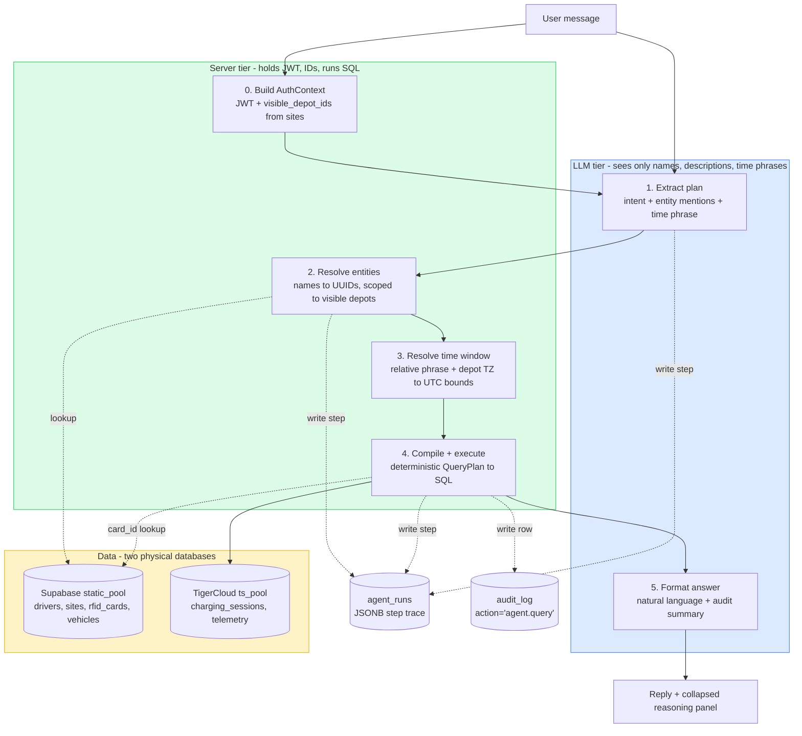

# Agent Search — Architecture Plan v0

**Status:** Draft, grounded against the live `favonius-pilot` Supabase project
(`hmxdpuzqkotmorheyexv`) and the current state of `src/`.

**Scope.** First slice of the depot chat agent. Single intent:
`consumption_by_user`. Read-only. Five power users, English only. Hosted as a
new module at `src/api/agent/`, mounted into `src/api/main.py` so it inherits
JWT auth, geo-blocking, rate limiting, and both DB pools.

---

## 1. Pipeline



### The trust boundary

Blue boxes (LLM) never produce or consume UUIDs. Green boxes (server) hold the
user's JWT context and are the only place where names become IDs. Every UUID
that reaches a SQL `WHERE` clause was either pulled from a verified JWT claim
or returned by a server-side resolver that filters by the user's
`visible_depot_ids`. This is the single most important architectural rule —
it eliminates prompt-injection authorization bypass.

### The two-database reality

`drivers`, `sites`, `vehicles`, `rfid_cards`, and the assignment join tables
live in **Supabase** (`static_pool`). `charging_sessions`, `telemetry`,
`prices`, and the run-trace tables live in **TigerCloud / TimescaleDB**
(`ts_pool`). Both pools are exposed by the FastAPI lifespan at
`src/api/main.py:248` and bundled into `src/db/pools.py::DatabasePools`. The
agent must never attempt a cross-database JOIN; resolution happens in
`static_pool`, aggregation in `ts_pool`, and the formatter joins the two in
Python.

---

## 2. Module layout

```
src/api/agent/
├── __init__.py
├── router.py                  # FastAPI APIRouter mounted at /agent
├── auth_context.py            # build_auth_context() — JWT dict -> AuthContext
├── plan.py                    # Pydantic types the LLM is allowed to produce
├── llm.py                     # Anthropic client wrapper, structured output
├── resolve.py                 # resolve_entities, resolve_time_window
├── format.py                  # format_answer
├── audit.py                   # agent_runs writer + audit_log mirror
├── stream.py                  # SSE event encoding
└── intents/
    ├── __init__.py
    ├── base.py                # IntentCompiler protocol
    └── consumption_by_user.py # the only intent in v0

tests/unit/agent/
├── conftest.py
├── test_plan_validation.py
├── test_resolve_entities.py
├── test_resolve_time_window.py
├── test_compile_consumption_by_user.py
├── test_auth_context.py
└── test_format.py

tests/integration/agent/
├── conftest.py
└── test_run_turn.py
```

---

## 3. Contracts between components

### 3.1 LLM-facing types (no IDs)

The model produces a `QueryPlan` containing names and time phrases. Pydantic
validation is the gate that keeps anything else from slipping through.

```python
# src/api/agent/plan.py
from pydantic import BaseModel
from typing import Literal


class EntityMention(BaseModel):
    kind: Literal["driver", "vehicle", "depot", "rfid"]
    text: str                    # e.g. "John", "Vilnius depot"


class TimeWindow(BaseModel):
    kind: Literal["relative", "absolute"]
    relative: Literal[
        "last_month", "this_month", "last_week", "this_week",
        "today", "yesterday",
    ] | None = None
    from_iso: str | None = None  # YYYY-MM-DD, inclusive
    to_iso: str | None = None    # YYYY-MM-DD, exclusive


class QueryPlan(BaseModel):
    intent: Literal["consumption_by_user"]
    subjects: list[EntityMention]
    time_window: TimeWindow
    group_by: list[Literal["driver", "depot", "day", "month", "category"]] = []
```

The Pydantic models are serialized into the LLM's structured-output schema.
Anything the model emits that doesn't match — including unexpected fields,
free-form `intent` values, or stringified UUIDs — fails validation and the
turn returns a "could not understand the request" error rather than executing
anything.

### 3.2 Server-side types (IDs allowed)

Built from the JWT and DB lookups. Never from LLM output.

```python
# src/api/agent/auth_context.py
from datetime import datetime
from uuid import UUID
from pydantic import BaseModel


class AuthContext(BaseModel):
    user_id: UUID
    organization_id: UUID | None    # None for favonius_admin acting cross-org
    role: Literal["favonius_admin", "customer_admin", "customer_operator"]
    visible_depot_ids: list[UUID]   # populated below; empty list never reached


class ResolvedEntity(BaseModel):
    kind: Literal["driver", "vehicle", "depot", "rfid"]
    display: str                    # canonical, e.g. "John Smith (Vilnius)"
    primary_id: UUID | None         # None means not found
    card_ids: list[UUID] = []       # for kind='driver': RFID cards assigned
    candidates: list["ResolvedEntity"] = []   # populated when ambiguous


class ResolvedTimeWindow(BaseModel):
    start_utc: datetime
    end_utc: datetime
    timezone: str                   # depot TZ, used in SQL "AT TIME ZONE"
```

### 3.3 Building the AuthContext

`verify_token` (`src/security/auth.py:204`) returns a dict, not a class. Build
the agent's `AuthContext` once per turn from that dict plus a single Supabase
query. **Do not invent a parallel auth abstraction.**

```python
# src/api/agent/auth_context.py
from src.db.queries import get_depots_for_organization, get_all_depots
from src.security.auth import get_user_organization_id, get_user_favonius_role


async def build_auth_context(token_payload: dict, static_pool) -> AuthContext:
    user_id = UUID(token_payload["sub"])
    role = get_user_favonius_role(token_payload)
    org_id = get_user_organization_id(token_payload)

    if role == "favonius_admin":
        depots = await get_all_depots(static_pool)
    else:
        if org_id is None:
            raise HTTPException(403, "user has no organization")
        depots = await get_depots_for_organization(static_pool, org_id)

    return AuthContext(
        user_id=user_id,
        organization_id=UUID(org_id) if org_id else None,
        role=role,
        visible_depot_ids=[UUID(d["depot_id"]) for d in depots],
    )
```

This mirrors the existing pattern at `GET /me/depots`
(`src/api/main.py:2705`). `verify_depot_access` (`src/security/auth.py:309`)
is **not** used here — it's a single-depot gatekeeper that returns void. The
agent enforces depot scoping at the resolver and compiler level instead.

### 3.4 Entity resolver

The single place where names become IDs. Auth-scopes every result to the
caller's visible depots.

The Supabase schema (verified live) names columns as `id` / `site_id`, not
`driver_id` / `depot_id`. The CLAUDE.md alias convention applies:
`SELECT id AS driver_id, site_id AS depot_id`. The `drivers` table has **no
`organization_id` column** — org scoping must JOIN through `sites`.

```python
# src/api/agent/resolve.py
async def _resolve_driver(
    text: str, auth: AuthContext, static_pool,
) -> list[ResolvedEntity]:
    rows = await static_pool.fetch(
        """
        SELECT
            d.id            AS driver_id,
            d.display_name,
            d.site_id       AS depot_id,
            d.external_driver_id,
            s.name          AS depot_name,
            COALESCE(
                array_agg(rcda.card_id) FILTER (WHERE rcda.card_id IS NOT NULL),
                ARRAY[]::uuid[]
            ) AS card_ids
        FROM drivers d
        JOIN sites s ON s.id = d.site_id
        LEFT JOIN rfid_card_driver_assignments rcda ON rcda.driver_id = d.id
        WHERE d.site_id = ANY($1::uuid[])
          AND d.status = 'active'
          AND (
            d.display_name      ILIKE $2
            OR d.email          ILIKE $2
            OR d.external_driver_id ILIKE $2
          )
        GROUP BY d.id, s.name
        ORDER BY d.display_name
        LIMIT 10
        """,
        auth.visible_depot_ids,
        f"%{text}%",
    )

    if not rows:
        return [ResolvedEntity(kind="driver", display=text, primary_id=None)]

    resolved = [
        ResolvedEntity(
            kind="driver",
            display=f"{r['display_name']} ({r['depot_name']})",
            primary_id=r["driver_id"],
            card_ids=list(r["card_ids"]),
        )
        for r in rows
    ]
    if len(resolved) == 1:
        return resolved
    # Ambiguous: keep the top match as primary, attach others as candidates.
    head, *tail = resolved
    head.candidates = [head] + tail
    return [head]
```

Notes:
- `auth.visible_depot_ids` is the only depot scope — favonius_admin gets every
  depot, everyone else gets their org's depots only. This is computed once in
  `build_auth_context` and reused.
- `external_driver_id` is included in the matcher; users will refer to drivers
  by badge/employee ID as often as by name.
- `card_ids` is populated here so the compiler can OR them into the
  `charging_sessions` filter without a second round-trip.
- The `vehicle`, `depot`, and `rfid` resolvers follow the same pattern; see
  `src/api/agent/resolve.py` for full code.

### 3.5 Time window resolver

```python
# src/api/agent/resolve.py
def resolve_time_window(
    window: TimeWindow,
    visible_depot_ids: list[UUID],
    depot_timezones: dict[UUID, str],
) -> ResolvedTimeWindow:
    """
    Convert a relative phrase or absolute date pair to UTC bounds in the
    depot's local timezone. When subjects span multiple depots in different
    timezones, bucket each driver in their own depot's TZ — this matches
    accounting intuition ("John's Tuesday" = his local Tuesday). The compiler
    is responsible for passing the right timezone per query slice.
    """
    ...
```

When a single query spans depots with different timezones, the compiler runs
one SQL execution per timezone group and merges in Python. For v0 with five
power users this is fine; revisit if usage grows past the pilot.

### 3.6 Per-intent compiler

Deterministic, hand-written, no LLM in the loop. One file per intent under
`src/api/agent/intents/`.

The compiler must handle **`driver_id` OR `card_id`** because OCPP sessions
land with `card_id` populated (from RFID Authorize) and `driver_id` is
derived later via `rfid_card_driver_assignments`. Sessions for unassigned
cards (or cards reassigned mid-period) have `driver_id IS NULL`. Filtering
on `driver_id` alone silently drops them.

```python
# src/api/agent/intents/consumption_by_user.py
def compile_consumption_by_user(
    plan: QueryPlan,
    resolved: list[ResolvedEntity],
    window: ResolvedTimeWindow,
) -> tuple[str, list]:
    drivers = [e for e in resolved if e.kind == "driver" and e.primary_id]
    if not drivers:
        raise ValueError("no driver subjects to query")

    driver_ids = [e.primary_id for e in drivers]
    card_ids = [c for e in drivers for c in e.card_ids]

    sql = """
        SELECT
            cs.driver_id,
            cs.card_id,
            DATE_TRUNC('day', cs.start_time AT TIME ZONE $5) AS day_local,
            SUM(cs.energy_delivered_kwh) AS energy_kwh,
            SUM(cs.cost_total)           AS cost_total,
            COUNT(*)                     AS session_count
        FROM charging_sessions cs
        WHERE (
            cs.driver_id = ANY($1::uuid[])
            OR cs.card_id  = ANY($2::uuid[])
          )
          AND cs.start_time >= $3
          AND cs.start_time <  $4
        GROUP BY cs.driver_id, cs.card_id, day_local
        ORDER BY day_local, cs.driver_id NULLS LAST
    """
    return sql, [driver_ids, card_ids, window.start_utc, window.end_utc, window.timezone]
```

Schema notes (verified):
- `charging_sessions.driver_id` (UUID, nullable) — added in migration 018.
- `charging_sessions.card_id` (UUID, nullable) — added in migration 018.
- `charging_sessions.energy_delivered_kwh` (NUMERIC).
- `charging_sessions.cost_total` (DECIMAL 10,2) — added in
  `src/websocket_handler/timescale_schema.py:67`.
- `charging_sessions.start_time` (TIMESTAMPTZ).
- **`charging_sessions` is a regular table, NOT a TimescaleDB hypertable.**
  No chunk pruning on `start_time`. The required indexes in §5.3 are not
  optional — without them this query is a sequential scan.

### 3.7 Per-turn entry point

```python
# src/api/agent/router.py
async def run_turn(
    message: str,
    token_payload: dict,
    static_pool,
    ts_pool,
) -> AgentReply:
    auth = await build_auth_context(token_payload, static_pool)
    run_id = await agent_runs_open(ts_pool, auth, message)

    try:
        plan = await llm_extract_plan(message)
        await agent_runs_step(ts_pool, run_id, "extract_plan", plan.model_dump())

        resolved = await resolve_entities(plan.subjects, auth, static_pool)
        await agent_runs_step(ts_pool, run_id, "resolve_entities",
                              [e.model_dump() for e in resolved])

        ambiguous = [e for e in resolved if e.candidates]
        if ambiguous:
            return await agent_runs_close(ts_pool, run_id, "disambiguation",
                                          AgentReply.disambiguation(ambiguous))

        not_found = [e for e in resolved if e.primary_id is None]
        if not_found:
            return await agent_runs_close(ts_pool, run_id, "not_found",
                                          AgentReply.not_found(not_found))

        window = resolve_time_window(plan.time_window, auth.visible_depot_ids,
                                      depot_timezones)
        sql, params = compile_consumption_by_user(plan, resolved, window)
        await agent_runs_step(ts_pool, run_id, "compile",
                              {"sql": sql, "param_shapes": describe(params)})

        rows = await ts_pool.fetch(sql, *params)
        await agent_runs_step(ts_pool, run_id, "execute", {"row_count": len(rows)})

        # Mirror to the existing admin audit feed so agent reads are visible
        # in the same channel that powers compliance review.
        await write_admin_audit_row(ts_pool, AdminAuditRow(
            actor_user_id=auth.user_id,
            actor_role=auth.role,
            organization_id=auth.organization_id,
            depot_id=None,  # may span multiple
            action="agent.query",
            target_type="charging_sessions",
            target_id=str(run_id),
            metadata={"intent": plan.intent, "row_count": len(rows)},
        ))

        reply = await format_answer(plan, resolved, window, rows)
        return await agent_runs_close(ts_pool, run_id, "success", reply)

    except Exception as e:
        await agent_runs_close(ts_pool, run_id, "error",
                               AgentReply.error(str(e)))
        raise
```

A note on the `driver_id IS NULL, card_id matched` case: the formatter sees
those rows separately and either attributes them to the resolved driver via
`card_id` lookup or surfaces them as "N sessions on cards not currently
assigned to this driver." If the user explicitly asks about unattributed
sessions, that's a separate intent.

---

## 4. LLM integration

The repo currently has no LLM dependency. The plan introduces one.

### 4.1 Dependency

Add to `pyproject.toml`:

```toml
anthropic = ">=0.40.0"
```

**Model selection is environment-driven.** The agent reads
`AGENT_LLM_MODEL` at startup (default `claude-sonnet-4-6`) and uses that
model for both `extract_plan` and `format_answer`. Switching models is a
redeploy of env, not a code change. The startup loader validates the value
against a known-good list (`claude-opus-4-7`, `claude-sonnet-4-6`,
`claude-haiku-4-5`) so a typo fails loudly. See `LLMConfig` in
`src/api/agent/llm.py`.

Default rationale: Sonnet 4.6 is fast, cheap enough at pilot volume
(€30–€45/month, see PRD §6), and reliable at structured output. Haiku 4.5
is the cost-optimization fallback. Opus 4.7 is reserved for future intents
that need stronger reasoning. The PRD-spec'd `scripts/agent_eval.py` runs
the same prompt across two models side-by-side so the choice is
data-driven, not vibes-driven.

The repo has a `claude-api` skill that codifies prompt caching, structured
output, and the migration story; use it when wiring the client.

### 4.2 API key plumbing

Use the existing rotation-aware secrets manager
(`src/security/secrets.py:42`):

```python
from src.security.secrets import get_secrets_manager

manager = get_secrets_manager()
api_key = manager.get_secret("ANTHROPIC_API_KEY")
```

`ANTHROPIC_API_KEY_PREVIOUS` is honored automatically during rotation
windows, matching the JWT secret pattern.

### 4.3 Structured output

Use the SDK's tool-use / structured-output mode with the `QueryPlan` JSON
schema generated from Pydantic. The model never sees raw JWTs, UUIDs, or
SQL; it sees only the user's message plus a system prompt describing the
allowed intents and entity kinds.

### 4.4 Prompt caching

Cache the system prompt (intent catalog + extraction rules + few-shot
examples). It's static across users and sessions, so cache hit rate should
approach 100% after warmup. See the `claude-api` skill for the canonical
pattern.

---

## 5. Database surface

### 5.1 Tables touched (read)

| Table | DB | Used for |
|---|---|---|
| `drivers` | Supabase | Resolve driver names to IDs |
| `sites` | Supabase | Org scoping, depot timezone, depot display name |
| `vehicles` | Supabase | Future intents (not v0) |
| `rfid_cards` | Supabase | Future intents (not v0) |
| `rfid_card_driver_assignments` | Supabase | Driver -> card_ids in resolver |
| `charging_sessions` | TimescaleDB | The actual aggregation in v0 |

### 5.2 Tables added (write)

| Table | DB | Purpose |
|---|---|---|
| `agent_runs` | TimescaleDB | Per-turn run trace with JSONB step log |
| `audit_log` | TimescaleDB | One row per executed query (existing table) |

### 5.3 Migrations

Two physical databases means two migration files. Top-level `migrations/`
runs against TimescaleDB; `migrations/supabase/` runs against Supabase. The
current top-level head is `024` (with a known duplicate that should be
cleaned up in a separate PR); the next free number is `025`. Supabase head
is `008`; the next free number is `009`.

#### 5.3.1 Supabase: `migrations/supabase/009_drivers_category.sql`

```sql
-- Add category column to drivers for delivery-vs-employee accounting splits.
-- Nullable on purpose: forces explicit categorization rather than silently
-- mis-attributing every existing driver as 'employee' via a default.
ALTER TABLE drivers
    ADD COLUMN category TEXT NULL
    CHECK (category IS NULL OR category IN ('delivery', 'employee'));

COMMENT ON COLUMN drivers.category IS
    'Driver role for accounting splits. NULL = uncategorized; the agent '
    'excludes NULLs from category-filtered queries and surfaces the '
    'excluded count in the answer.';
```

#### 5.3.2 TimescaleDB: `migrations/025_agent_runs.sql`

```sql
-- Per-turn audit trail for the natural-language depot agent.
-- Mirrors the optimization_runs shape: domain-specific run record with a
-- JSONB step trace and outcome status. Complements (does NOT replace)
-- audit_log; agent reads also write a row to audit_log via
-- write_admin_audit_row() so they appear in the existing admin audit feed.
CREATE TABLE IF NOT EXISTS agent_runs (
    run_id           UUID PRIMARY KEY DEFAULT gen_random_uuid(),
    user_id          UUID NOT NULL,
    organization_id  UUID,                    -- NULL for cross-org admin runs
    depot_id         UUID,                    -- NULL when query spans depots
    user_message     TEXT NOT NULL,
    final_intent     TEXT,
    steps_json       JSONB NOT NULL DEFAULT '[]'::jsonb,
    status           TEXT NOT NULL
        CHECK (status IN ('running', 'success', 'disambiguation', 'not_found', 'error')),
    duration_ms      INTEGER,
    created_at       TIMESTAMPTZ NOT NULL DEFAULT NOW()
);

CREATE INDEX IF NOT EXISTS idx_agent_runs_user_created
    ON agent_runs (user_id, created_at DESC);
CREATE INDEX IF NOT EXISTS idx_agent_runs_org_created
    ON agent_runs (organization_id, created_at DESC);
```

#### 5.3.3 TimescaleDB: `migrations/026_charging_sessions_agent_indexes.sql`

These are **required for v0**, not nice-to-have. `charging_sessions` is a
regular table; without these the agent's WHERE-clause is a sequential scan
once each customer has more than a few weeks of data.

Run as a separate migration so the `CONCURRENTLY` form can be used in
production. For local dev / first deploy where the table is small, the plain
`CREATE INDEX` form is fine; switch to `CONCURRENTLY` for any environment
with traffic. Note: `CONCURRENTLY` cannot run inside a transaction, so check
that `scripts/run_migrations.py` runs each file outside of `BEGIN`/`COMMIT`
or split into per-statement files.

```sql
CREATE INDEX IF NOT EXISTS idx_sessions_driver_time
    ON charging_sessions (driver_id, start_time DESC)
    WHERE driver_id IS NOT NULL;

CREATE INDEX IF NOT EXISTS idx_sessions_card_time
    ON charging_sessions (card_id, start_time DESC)
    WHERE card_id IS NOT NULL;
```

---

## 6. REST + streaming surface

### 6.1 Endpoints

| Method | Path | Description |
|---|---|---|
| `POST` | `/agent/turn` | Synchronous one-shot. Returns the final reply only. |
| `POST` | `/agent/turn/stream` | SSE stream of step + answer events. |
| `GET`  | `/agent/runs/{run_id}` | Fetch a stored run trace (for the UI's reasoning panel after the stream closes). |

All three require the standard JWT bearer middleware and inherit the
geo-block + tenant-mirror chain already wired in `src/api/main.py`.

### 6.2 SSE wire format

Reuses the `StreamingResponse` precedent at `src/api/main.py:4608` (the CSV
export endpoint). For SSE, add explicit headers to disable proxy buffering:

```python
return StreamingResponse(
    _generate(),
    media_type="text/event-stream",
    headers={
        "Cache-Control": "no-cache",
        "X-Accel-Buffering": "no",     # nginx
        "Connection": "keep-alive",
    },
)
```

Events the client receives:

```
event: step
data: {"name": "extract_plan", "summary": "consumption_by_user, 1 driver, last_month"}

event: step
data: {"name": "resolve_entities", "summary": "Found 1 driver: John Smith (Vilnius)"}

event: step
data: {"name": "execute", "summary": "147 sessions across 23 days"}

event: answer
data: {"text": "John Smith consumed 1,243 kWh in May 2026 ..."}
```

Each step is also written to `agent_runs.steps_json` server-side, so the
audit record exists independent of whether the client renders the panel or
the connection drops mid-stream.

### 6.3 Rate limiting

Use the **`check_optimize_limit`** tier (10 req/min per user). LLM calls are
the cost driver; this matches the "expensive operation" semantics and avoids
inventing a new rate limit class for five users. Limit applies at
stream-open; per-event limiting on a single conversation turn isn't useful.

---

## 7. Auth and authorization

| Role | Can use chat? | Notes |
|---|---|---|
| `favonius_admin` | Yes | Sees all depots; every turn writes one `audit_log` row with `action='admin.read'` (per CLAUDE.md cross-org pattern) and one with `action='agent.query'`. |
| `customer_admin` | Yes | Scoped to `app_metadata.organization_id`. |
| `customer_operator` | Yes | Same scope as customer_admin; consistent with their existing `/depots/*/state` access. |
| Unauthenticated | No | `Depends(verify_token)` returns 401 before reaching `run_turn`. |

The agent never calls `verify_depot_access` per depot. Scoping is enforced
once, in `build_auth_context`, by computing `visible_depot_ids` from
`sites.organization_id`. Every downstream resolver and compiler filters on
`visible_depot_ids`. A user cannot reference a depot they can't see, because
its UUID is never in the candidate set.

---

## 8. Audit and observability

### 8.1 `agent_runs` (new)

Domain-specific run trace, mirrors `optimization_runs`. One row per turn,
JSONB step log, status, duration. Indexed for "show this user's last 50
chats" UX.

### 8.2 `audit_log` (existing)

One row written per executed SQL query via
`src/security/admin_audit.py::write_admin_audit_row`. Fields:
`action='agent.query'`, `target_type='charging_sessions'`,
`target_id=run_id`, `metadata={'intent': ..., 'row_count': ...}`. Keeps
agent reads visible in the same compliance feed admins already use.

### 8.3 Prometheus metrics

Add to `src/monitoring/metrics.py`:

- `agent_turns_total{status,intent}` — counter
- `agent_turn_duration_seconds{intent}` — histogram
- `agent_llm_tokens_total{model,direction}` — counter (input vs output)
- `agent_resolver_misses_total{kind}` — counter (entity not found / ambiguous)

---

## 9. Testing

Unit and integration tests are non-negotiable per the repo's engineering
preferences. Coverage target: 90% on `src/api/agent/` (matches the optimizer
and surrogate model bar).

### 9.1 Unit tests (no DB, no LLM)

- `test_plan_validation.py` — Pydantic gates malformed LLM output (extra
  fields, wrong types, free-form intents, embedded UUIDs in `text`).
- `test_resolve_entities.py` — mock asyncpg pool; assert SQL parameter
  shapes, org scoping, ambiguity handling, not-found handling, card_id
  population.
- `test_resolve_time_window.py` — every `relative` value, DST boundary
  cases, multi-TZ subjects.
- `test_compile_consumption_by_user.py` — golden-file SQL output, the
  `driver_id OR card_id` branch, NULL-driver footnote, empty-driver-list
  error.
- `test_auth_context.py` — favonius_admin gets all depots, customer_admin
  gets org depots, missing org_id raises 403, role unknown -> 403.
- `test_format.py` — formatter handles zero rows, NULL-driver rows, single
  driver, multiple drivers, ambiguous resolution.

### 9.2 Integration tests (real DB pools, fake LLM)

- `test_run_turn.py` — end-to-end with seeded `drivers`, `sites`, and
  `charging_sessions` fixtures. Asserts `agent_runs` row written, `audit_log`
  row written, SSE events emitted in order, error path closes the run with
  `status='error'`.

### 9.3 Snapshot tests for LLM extraction

A small fixture set (~20 messages) maps natural-language inputs to expected
`QueryPlan` outputs. Run against the live LLM nightly, not on every CI run,
to catch model-side regressions without paying the latency on every push.

### 9.4 Acceptance test

Add `AT-18` to the PRD acceptance test list:

> **AT-18 Agent Search End-to-End** — Authenticated user submits "How much
> did John charge last month?" via `POST /agent/turn/stream`. Agent
> resolves "John" to a driver in the user's org, computes UTC bounds for
> "last month" in the depot's timezone, executes the aggregation query,
> writes one `agent_runs` row and one `audit_log` row, and returns a
> natural-language reply. A user from a different org sending the same
> message gets a "driver not found" reply (proving cross-org isolation).

---

## 10. What the agent does NOT do in v0

- **Writes of any kind.** No "schedule John for a charge", no "update
  vehicle assignment". Reads only.
- **Multi-intent composition.** Only `consumption_by_user`. Other intents
  (`session_list`, `vehicle_status`, `tariff_check`) are added one at a
  time, each with its own compiler and tests.
- **Cross-organization queries** (except for `favonius_admin`). The
  `visible_depot_ids` computation restricts every resolver and every
  compiled query to the user's org's depots.
- **Lithuanian language.** English only at v0; the LLM extraction prompt is
  the single place to extend later.
- **On-device LLMs.** API-hosted models for v0; revisit when latency or
  cost becomes a concern.
- **Joins across the two databases in SQL.** Resolution in `static_pool`,
  aggregation in `ts_pool`, merge in Python.
- **Charging-cost projections / tariff math.** `cost_total` is read as-is
  from `charging_sessions`. A future intent can pull `sites.tariff_config`
  for projections.

---

## 11. Implementation order

1. **Migrations** (`migrations/supabase/009_…`,
   `migrations/025_agent_runs.sql`, `migrations/026_…indexes.sql`). Land
   first so subsequent code can assume the schema.
2. **Pydantic types** (`src/api/agent/plan.py`, `src/api/agent/auth_context.py`)
   plus full unit tests for each.
3. **Resolvers** (`src/api/agent/resolve.py`) plus unit tests.
4. **Compiler** (`src/api/agent/intents/consumption_by_user.py`) plus
   golden-file unit tests.
5. **LLM client + prompt** (`src/api/agent/llm.py`) plus snapshot fixture.
6. **Audit writer** (`src/api/agent/audit.py`) plus unit tests.
7. **Router + SSE** (`src/api/agent/router.py`, `src/api/agent/stream.py`)
   plus integration test.
8. **Mount in `src/api/main.py`** behind a feature flag
   (`AGENT_SEARCH_ENABLED`, default `false`). Promote to default-on once
   the integration test passes against staging.
9. **Prometheus metrics + Grafana panel.**
10. **Update CLAUDE.md and `docs/API.md`** with the new endpoints.

---

## 12. Open product questions

### 12.1 How to split delivery vs employee charging

Recommended path: **`drivers.category`** as defined in §5.3.1 (nullable,
two-value check constraint) for v1. Revisit only if the customer pushes
back with a use case that needs per-card splits — for example, a single
driver who legitimately holds both a delivery card and a personal card.
That case is solved later by adding `rfid_cards.purpose TEXT`. Don't bake
the constraint into the schema yet.

### 12.2 favonius_admin chat behavior

Two questions to answer before launch:

1. Should `favonius_admin` be allowed to query across organizations from a
   single chat turn? Today the AuthContext sets `organization_id=None` for
   admins, which permits it. Conservative default: yes, but every turn writes
   `admin.read` to `audit_log`.
2. Should the reasoning panel show admins more detail (raw SQL, parameter
   values) than customer roles see? Suggested: yes, gated on `role ==
   'favonius_admin'`.

### 12.3 Future intents queue

After `consumption_by_user`, the intents most likely to land next are:

- `session_list` — recent sessions for a driver / vehicle / depot.
- `vehicle_status` — current SoC, charging state, ETA-to-target.
- `tariff_check` — what would a session have cost under tariff X?

Each adds a new file under `src/api/agent/intents/` and a new value to the
`QueryPlan.intent` literal. The resolver, time-window logic, AuthContext,
and audit pipeline are reused unchanged.

---

## 13. References

- Original draft: `docs/plans/agent_search_architecture_v0.md` (this file).
- JWT verification: `src/security/auth.py:204` (`verify_token`).
- Single-depot gatekeeper (NOT used here): `src/security/auth.py:309`
  (`verify_depot_access`).
- Visible-depot pattern: `src/api/main.py:2705` (`GET /me/depots`).
- DB pools: `src/api/main.py:248` (lifespan), `src/db/pools.py`
  (`DatabasePools`).
- Streaming precedent: `src/api/main.py:4608` (CSV export).
- Admin audit pattern: `src/security/admin_audit.py:35`
  (`write_admin_audit_row`).
- Secrets rotation: `src/security/secrets.py:42` (`get_secrets_manager`).
- Optimization runs (shape mirror for `agent_runs`):
  `src/db/models.py:379`.
- Sister plan doc: `docs/plans/alerts-pipeline.md`.
- Supabase project: `favonius-pilot` (`hmxdpuzqkotmorheyexv`),
  schemas verified live as of 2026-05-03.
